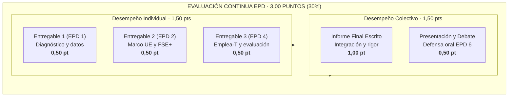

# Cronograma Docente de Prácticas (EPD) · Curso 2026-27
## Políticas Sociolaborales y de Empleo (102023) · Universidad Pablo de Olavide
### Grado en Relaciones Laborales y Recursos Humanos · Doble Grado en Derecho y RRLL-RRHH

---

## 1. Identificación y Marco General del Proyecto de EPD

* **Proyecto Unificado de Prácticas:** *«Del diagnóstico a la acción: políticas sociolaborales frente al desempleo de larga duración y de las personas mayores de 45 años»*.
* **Marco de Gobernanza y Financiación:** Políticas Activas de Empleo en el marco del Fondo Social Europeo Plus (FSE+ 2021-2027), Programa Estatal de Inclusión Social y Empleo (FESO) y Programa FSE+ Andalucía 2021-2027.
* **Ponderación en la Asignatura:** **30% de la calificación final (3,00 puntos sobre 10)**, en régimen de evaluación continua con asistencia obligatoria en aula de informática.
  * **Dimensión individual (1,50 puntos):** 3 entregables individuales realizados en aula al cierre de las sesiones 1, 2 y 4 (0,50 puntos cada uno).
  * **Dimensión colectiva (1,50 puntos):** 
    * **Informe final integrado por equipos (1,00 punto):** Documento técnico que consolida los 3 bloques, con asignación nominativa de responsabilidad por bloque.
    * **Presentación oral y debate en el aula (0,50 puntos):** Exposición de conclusiones, comparativa y defensa de propuestas en la EPD 6.
* **Duración total nuclear:** **6 sesiones de 1,5 horas (9 horas de laboratorio informático)** idénticas para Línea 1 y Línea 2. En Línea 2, la sesión oficial 7 de la semana 13 se destina a clínica de retorno formativo, revisión personalizada y refuerzo de cara a la prueba de EB.

---

## 2. Calendario Oficial de EPD: Cuadro de Mando de Fechas, Horas y Aulas

> [!NOTE]
> Fuente oficial: Extracción verificada de `horarios L1.pdf` y `horarios L2.pdf` (CIC-UPO, 24/09/2026). La secuencia nuclear de 6 sesiones está sincronizada entre todas las líneas y grupos.

| Sesión | Sem. | Línea 1 · Grupo EPD11 (E24AINFB01) | Línea 1 · Grupo EPD12 (E14AINF1) | Línea 2 · Grupo EPD21 (E10AINF6) | Bloque Temático y Entregable |
| :---: | :---: | :---: | :---: | :---: | :--- |
| **EPD 1** | **4** | Mar 06/10 · 11:30–13:00 | Mar 06/10 · 13:00–14:30 *(martes)* | Vie 09/10 · 19:30–21:00 | **Bloque 1:** Radiografía estadística y diagnóstico empírico. *(Entregable Individual 1 · 0,50 pt)* |
| **EPD 2** | **7** | Mar 27/10 · 11:30–13:00 | Lun 26/10 · 13:00–14:30 | Vie 30/10 · 19:30–21:00 | **Bloque 2:** Dimensión institucional UE y financiación FSE+. *(Entregable Individual 2 · 0,50 pt)* |
| **EPD 3** | **9** | Mar 10/11 · 11:30–13:00 | Lun 09/11 · 13:00–14:30 | Vie 13/11 · 19:30–21:00 | **Bloque 3 (I):** PAE en perspectiva comparada (OCDE) y Programa Talento 45+ (Cámaras). |
| **EPD 4** | **10** | Mar 17/11 · 11:30–13:00 | Lun 16/11 · 13:00–14:30 | Vie 20/11 · 19:30–21:00 | **Bloque 3 (II):** Programa Emplea-T (Orden 03/10/2024), diseño técnico y evaluación. *(Entregable Individual 3 · 0,50 pt)* |
| **EPD 5** | **11** | Mar 24/11 · 11:30–13:00 | Lun 23/11 · 13:00–14:30 | Vie 27/11 · 19:30–21:00 | **Taller Integrador:** Clínica de redacción de informe final, calibración y preparación de defensa. |
| **EPD 6** | **12** | Mar 01/12 · 11:30–13:00 | Lun 30/11 · 13:00–14:30 | Vie 04/12 · 19:30–21:00 | **Cierre del Proyecto:** Presentaciones orales de equipos, debate comparado y entrega final. *(Informe Grupal 1,00 pt + Defensa 0,50 pt)* |
| *EPD 7* | *13* | — *(Fin de prácticas en L1 el 01/12)* | — | Vie 11/12 · 19:30–21:00 | *Clínica de retorno y feedback formativo individualizado (solo L2).* |

---

## 3. Sincronización EB ⇄ EPD (Prerrequisitos Conceptuales)

Para que el trabajo en el aula de informática sea fluido y riguroso, cada sesión de EPD se apoya directamente en los conceptos teóricos vistos previamente en las Enseñanzas Básicas (EB):

* **Antes de la EPD 1 (Semana 4):**
  * EB 1 a 4: Tipología del desempleo, tasas de actividad y paro por grupos de edad.
  * EB 5: Flujos en el mercado de trabajo, persistencia del desempleo e histeresis.
  * EB 6 y EB 7: Tipología de PAE e incentivos a la contratación (explicada el mismo 06/10 y 09/10).
* **Antes de la EPD 2 (Semana 7):**
  * EB 6 y EB 8: Marco institucional del Sistema Nacional de Empleo, gobernanza europea y directrices del Semestre Europeo.
* **Antes de la EPD 3 (Semana 9):**
  * EB 8: Comparativa internacional de modelos de empleo y evaluación de impacto de las PAE (evidencia de Card, Kluve y Weber; AIReF).
* **Antes de la EPD 4 (Semana 10):**
  * EB 7: Diseño analítico de subsidios a la contratación: subvención a tanto alzado vs. bonificación de cotizaciones; efectos no deseados (peso muerto, sustitución, desplazamiento, estigma y *creaming*); cálculo del coste neto por empleo.
* **Antes de la EPD 5 y 6 (Semanas 11 y 12):**
  * EB 9 a 11: Interacción entre protección pasiva (prestaciones/subsidios) y activación laboral, facilitando que el informe final incorpore propuestas rigurosas de reforma.

---

## 4. Desarrollo Detallado Sesión por Sesión (90 Minutos Cada Una)

---

### Sesión EPD 1 · Radiografía de la Situación: ¿Qué Dicen los Datos?
**Bloque 1 · Diagnóstico Empírico del Desempleo de Larga Duración y de Mayores de 45 Años**

* **Fechas y grupos:** 
  * EPD11: Martes 06/10/2026 (11:30–13:00) · Aula E24AINFB01
  * EPD12: Martes 06/10/2026 (13:00–14:30) · Aula E14AINF1
  * EPD21: Viernes 09/10/2026 (19:30–21:00) · Aula E10AINF6
* **Modalidad Operativa:** **Laboratorio Digital Autoguiado Anti-IA** a través de la Web App Oficial de EPD de PSLL (`https://mhidper.github.io/micro_apps/epd_laboratorio.html`). Diseñada para garantizar el 90% de autonomía del estudiante y asegurar la máxima homogeneidad y equidad formativa, especialmente ante la eventualidad de grupos en fase de asignación de profesorado.
* **Sistema de Acceso y Trazabilidad:**
  1. *Identificación Institucional:* El alumno accede introduciendo su **acrónimo oficial UPO** (usuario de los servicios virtuales).
  2. *Código EPD Permanente:* La primera vez que entra, la plataforma le genera y muestra su **Código de Estación EPD**. Este código queda registrado en su perfil y será su identificador invariable durante todo el curso.
  3. *Asignación Dinámica Individualizada:* Dicho código desbloquea de forma única su caso de trabajo (cohorte específica de edad, ámbito territorial asignado y series temporales), impidiendo la copia o el trasvase de respuestas entre compañeros.
  4. *Telemetría y Registro Docente Activo:* El sistema registra en tiempo real las entradas, tiempo efectivo de permanencia, clics de interacción y avance por fases, ofreciendo al profesor un cuadro de mando integral de seguimiento.
* **Barreras Tecnológicas Anti-IA Integradas:**
  * *Explorador dinámico en DOM local:* Microdatos de la EPA y Eurostat navegables mediante filtros interactivos que la IA externa no puede consultar automáticamente.
  * *Clipboard Trap (Detección de Pegado):* Bloqueo y registro de eventos de pegado masivo instantáneo (`paste`), exigiendo redacción progresiva en teclado con monitorización de velocidad de tecleo (WPM).
  * *Validación Aritmética Dinámica:* La plataforma comprueba en tiempo real si los cálculos matemáticos del alumno coinciden con su caso asignado antes de permitir el paso al dictamen final, neutralizando las alucinaciones numéricas típicas de los LLMs.
* **Estructura de la sesión (90 min):**
  * **00–15 min · Apertura y Activación:** Acceso a la Web App, registro del código EPD y visualización de la vídeo-píldora introductoria de Manuel con el reto de la sesión.
  * **15–50 min · Laboratorio de Microdatos:** Interacción con el visor de datos de la EPA (INE) y Eurostat (LFS). Obtención de magnitudes clave: tasa de paro por cohortes, peso de parados de larga duración (>12 meses) y de muy larga duración (>24 meses) y variación decenal.
  * **50–70 min · Checkpoint Cuantitativo y Validación:** Introducción de los cálculos en el validador interactivo de la web para su verificación matemática en tiempo real.
  * **70–90 min · Dictamen Técnico y Sellado Digital:** Redacción individual del dictamen socioeconómico (250-300 palabras) sobre la naturaleza estructural vs. coyuntural del problema en Andalucía y sellado criptográfico del comprobante oficial de entrega.
* **Entregable y Evaluación:** **Entregable Individual 1 (0,50 puntos)**. Sellado y validado directamente en la Web App al término de la sesión para alimentar el Pasaporte de Evaluación Continua.

---

### Sesión EPD 2 · Dimensión Europea del Reto: Del Compromiso Político al FSE+
**Bloque 2 · Marco Institucional, Gobernanza y Financiación Comunitaria**

* **Fechas y grupos:** 
  * EPD12: Lunes 26/10/2026 (13:00–14:30) · Aula E14AINF1
  * EPD11: Martes 27/10/2026 (11:30–13:00) · Aula E24AINFB01
  * EPD21: Viernes 30/10/2026 (19:30–21:00) · Aula E10AINF6
* **Objetivo de la sesión:** Reconstruir la cadena de gobernanza multinivel que conecta los principios políticos europeos con el gasto público real en el territorio, identificando los objetivos específicos del Fondo Social Europeo Plus (FSE+) dirigidos a la inserción laboral de colectivos vulnerables.
* **Materiales de trabajo:**
  1. *Compromiso político:* Principios 4 (apoyo activo al empleo) y 8 (diálogo social) del Pilar Europeo de Derechos Sociales.
  2. *Diagnóstico y recomendaciones:* Recomendaciones específicas por país del Consejo de la UE a España (Semestre Europeo) e Informe País de la Comisión Europea.
  3. *Regulación y programación financiera:* Reglamento (UE) 2021/1057 del FSE+; Programa Estatal de Inclusión Social y Empleo (FESO) y Programa FSE+ Andalucía 2021-2027.
* **Estructura de la sesión (90 min):**
  * **00–20 min · Presentación del marco:** Explicación del funcionamiento del Semestre Europeo y de la arquitectura de la Política de Cohesión (de la recomendación comunitaria a la cofinanciación autonómica).
  * **20–50 min · Taller de rastreo documental en equipos:** Búsqueda y cotejo guiado de los Objetivos Específicos (OE) del FSE+ asignados a parados de larga duración y personas de edad avanzada (en especial OE1 sobre acceso al empleo y OE3 sobre modernización de servicios).
  * **50–75 min · Análisis comparado FESO vs. FSE+ Andalucía:** Identificación de las prioridades de inversión, tipología de acciones cofinanciadas y tasa de cofinanciación comunitaria asignada a Andalucía.
  * **75–90 min · Redacción y subida del Entregable Individual 2:** Documento conciso que contenga:
    1. Diagrama de flujo de trazabilidad (Pilar Europeo $\rightarrow$ Recomendación Consejo $\rightarrow$ Prioridad FSE+ $\rightarrow$ Programa Operativo).
    2. Justificación técnica de por qué estos dos colectivos requieren líneas específicas y diferenciadas de financiación.
* **Entregable y Evaluación:** **Entregable Individual 2 (0,50 puntos)**. Subida telemática individual al cierre de la sesión.

---

### Sesión EPD 3 · Políticas Activas de Empleo: Enfoque Comparado y el Programa Talento 45+
**Bloque 3 (Parte I) · Modelos Internacionales de Gasto en PAE y Servicios de Acompañamiento**

* **Fechas y grupos:** 
  * EPD12: Lunes 09/11/2026 (13:00–14:30) · Aula E14AINF1
  * EPD11: Martes 10/11/2026 (11:30–13:00) · Aula E24AINFB01
  * EPD21: Viernes 13/11/2026 (19:30–21:00) · Aula E10AINF6
* **Objetivo de la sesión:** Examinar la composición del gasto público en políticas activas en la OCDE para contrastar el modelo español con otros modelos europeos (Alemania y Francia) y analizar un instrumento real de orientación y cualificación: el Programa Talento 45+ de las Cámaras de Comercio.
* **Materiales de trabajo:**
  1. *Base de datos OCDE:* Gasto público en medidas del mercado de trabajo desglosado en las 6 categorías canónicas de PAE (servicios de empleo, formación, incentivos a la contratación, empleo protegido, creación directa y emprendimiento).
  2. *Dossier de proyecto:* Guía oficial y memoria de ejecución del Programa Talento 45+ de la Cámara de Comercio de España / Fondo Social Europeo.
* **Estructura de la sesión (90 min):**
  * **00–20 min · Marco analítico de la OCDE:** Repaso de las 6 categorías de gasto público en PAE. Discusión de los desequilibrios históricos de España (predominio de incentivos vs. menor peso de orientación personalizada y formación).
  * **20–45 min · Taller de datos OCDE:** Procesamiento del gráfico comparativo España–Alemania–Francia: gasto por parado en porcentaje del PIB per cápita y distribución porcentual del presupuesto entre categorías.
  * **45–75 min · Análisis de caso: Programa Talento 45+:** Desglose del itinerario de intervención (diagnóstico individualizado, itinerario formativo en competencias digitales y taller de búsqueda activa). Clasificación de sus actuaciones dentro de las categorías OCDE.
  * **75–90 min · Debate y síntesis de equipo:** Discusión sobre la idoneidad de los programas de orientación/recualificación frente a los subsidios directos a empresas para el colectivo sénior. Preparación de notas para el informe final.
* **Entregable y Evaluación:** Checkpoint de equipo en aula (hoja de notas compartida y validada por el docente). Este bloque alimentará la sección correspondiente del Informe Final Grupal.

---

### Sesión EPD 4 · Incentivos a la Contratación: Análisis Práctico del Programa Emplea-T
**Bloque 3 (Parte II) · Normativa Aplicada, Decisiones Empresariales y Efectos en el Empleo**

* **Fechas y grupos:** 
  * EPD12: Lunes 16/11/2026 (13:00–14:30) · Aula E14AINF1
  * EPD11: Martes 17/11/2026 (11:30–13:00) · Aula E24AINFB01
  * EPD21: Viernes 20/11/2026 (19:30–21:00) · Aula E10AINF6
* **Objetivo de la sesión:** Examinar de forma práctica y aplicada cómo funciona una política real de la Junta de Andalucía: la Orden de 3 de octubre de 2024 (Programa Emplea-T), simulando cuánto apoyo supone la ayuda para una empresa frente al coste salarial y valorando si las condiciones exigidas evitan la rotación indeseada de trabajadores.
* **Materiales de trabajo:**
  1. *Texto normativo oficial:* **Orden de 3 de octubre de 2024**, por la que se aprueban las bases reguladoras del Programa Emplea-T (BOJA).
  2. *Presentación de apoyo docente:* Esquema visual de las líneas de subvención (Líneas 1, 2, 4 y 7) y colectivos prioritarios.
  3. *Simulador interactivo de costes:* Herramienta visual en la Web App para calcular el porcentaje de coste de personal que cubre la subvención según el salario de convenio.
* **Estructura de la sesión (90 min):**
  * **00–20 min · Análisis del esquema de la Orden:** Presentación guiada de los aspectos clave: beneficiarios, cuantías fijas, suplementos por colectivos vulnerables y requisitos de mantenimiento del contrato (mínimo 12 meses).
  * **20–55 min · Taller práctico con el simulador de costes:**
    1. *Apoyo efectivo a la contratación:* ¿Qué proporción del coste anual de personal representa la ayuda para un contrato indefinido ordinario frente a uno de mayor de 45 años o parado de larga duración?
    2. *Reflexión sobre decisiones de contratación:* ¿Qué garantías exige la orden para que las empresas creen empleo neto y no sustituyan a trabajadores previos? ¿Es suficiente el periodo de 12 meses para consolidar el puesto?
  * **55–75 min · Comparativa de enfoques (Emplea-T vs. Talento 45+):** Ventajas de ayudar a la empresa en la contratación (lado de la demanda) frente a formar y orientar al trabajador desempleado (lado de la oferta).
  * **75–90 min · Redacción y validación del Entregable Individual 3:** Breve ficha aplicada donde cada estudiante resume:
    1. Correspondencia básica de las líneas de Emplea-T con las categorías OCDE.
    2. Impacto de la subvención en la reducción de costes de contratación para el colectivo analizado.
    3. Valoración laboral razonada: propuestas sencillas para mejorar la eficacia de la convocatoria.
* **Entregable y Evaluación:** **Entregable Individual 3 (0,50 puntos)**. Cumplimentado y validado en la plataforma al cierre de la sesión.

---

### Sesión EPD 5 · Taller de Integración y Clínica de Informes
**Integración de Bloques, Calibración de Conclusiones y Preparación de la Defensa**

* **Fechas y grupos:** 
  * EPD12: Lunes 23/11/2026 (13:00–14:30) · Aula E14AINF1
  * EPD11: Martes 24/11/2026 (11:30–13:00) · Aula E24AINFB01
  * EPD21: Viernes 27/11/2026 (19:30–21:00) · Aula E10AINF6
* **Objetivo de la sesión:** Asegurar la consistencia metodológica del documento final del equipo, integrando los 3 bloques desarrollados, resolviendo discrepancias analíticas entre miembros y preparando los soportes visuales para la exposición oral de la EPD 6.
* **Materiales de trabajo:**
  1. Guía de redacción del Informe Final y rúbrica oficial de evaluación.
  2. Borradores de los Bloques 1, 2 y 3 elaborados por los estudiantes responsables de cada sección.
  3. Plantilla oficial de presentación (PowerPoint institucional PSLL).
* **Estructura de la sesión (90 min):**
  * **00–15 min · Pautas de calidad editorial y científica:** Criterios de evaluación del informe final: coherencia interna, rigor en el uso de fuentes oficiales, calidad gráfica (gráficos legibles con fuentes citadas) y profundidad en las recomendaciones de política laboral.
  * **15–65 min · Clínica de trabajo tutorizada por el profesor:** Trabajo intensivo de los equipos en el aula de informática. El docente revisa mesa por mesa:
    * Revisión del Bloque 1: ¿Los datos sustentan realmente el diagnóstico?
    * Revisión del Bloque 2: ¿Está bien documentada la trazabilidad de los fondos FSE+?
    * Revisión del Bloque 3: ¿El análisis de Emplea-T y Talento 45+ contiene juicio crítico o es mera copia de la normativa?
    * Redacción conjunta del apartado de **Conclusiones y Recomendaciones de Política Sociolaboral**.
  * **65–90 min · Ensayo de tiempos y reparto de exposición:** Asignación de roles para la sesión 6 (10 minutos por equipo: 3 min diagnóstico, 3 min gobernanza/fondos, 3 min políticas/medidas y 1 min propuestas).
* **Entregable:** Entrega del borrador consolidado al final de la sesión para visto bueno docente previo a la presentación.

---

### Sesión EPD 6 · Presentaciones Finales, Debate Comparado y Cierre del Proyecto
**Defensa Oral por Equipos, Discusión Crítica y Entrega del Informe Completo**

* **Fechas y grupos:** 
  * EPD12: Lunes 30/11/2026 (13:00–14:30) · Aula E14AINF1
  * EPD11: Martes 01/12/2026 (11:30–13:00) · Aula E24AINFB01
  * EPD21: Viernes 04/12/2026 (19:30–21:00) · Aula E10AINF6
* **Objetivo de la sesión:** Exponer públicamente las conclusiones del informe técnico, someter las propuestas a la crítica razonada del plenario del aula y consolidar el aprendizaje acumulado sobre políticas activas de empleo.
* **Estructura de la sesión (90 min):**
  * **00–05 min · Instrucciones y orden de intervenciones:** Sorteo o asignación de turnos. Regla estricta de control de tiempo (semáforo de tiempo).
  * **05–75 min · Rondas de exposición y debate:**
    * Cada equipo dispone de un máximo de **8-10 minutos de presentación** apoyada en soporte visual limpio.
    * Turno de preguntas de 3-5 minutos por parte del profesor y de los equipos oponentes.
    * Todos los miembros del equipo deben intervenir defendiendo el bloque del que han sido responsables.
  * **75–90 min · Síntesis docente, conclusiones globales y cierre:**
    * Balance docente sobre las debilidades y fortalezas observadas en las propuestas.
    * Registro formal de entregas definitivas del Informe Escrito en el Aula Virtual.
* **Entregables y Evaluación:**
  * **Informe Final Escrito por Equipos (1,00 punto):** Subida del documento final en PDF.
  * **Presentación Oral y Defensa Individual (0,50 puntos):** Calificación basada en claridad expositiva, dominio conceptual y capacidad de respuesta.

---

### *Sesión Complementaria EPD 7 (Exclusiva para Línea 2)*
**Clínica de Retorno Formativo y Preparación del Examen Final**

* **Fecha y grupo:** Viernes 11/12/2026 (19:30–21:00) · Aula E10AINF6
* **Contenido:** Sesión de devolución cualitativa personalizada de los informes del proyecto, análisis de errores conceptuales comunes y taller de resolución de preguntas tipo examen sobre Políticas Activas (Tema 2) y Evaluación de Impacto (Tema 3 y 4) para reforzar la prueba teórica final (70%).

---

## 5. Arquitectura de Calificación y Rúbrica Oficial (3,00 Puntos Totales)

### A. Desglose de Puntuación
1. **Entregables individuales de sesión (1,50 puntos):**
   * *Entregable 1 (0,50 pt):* Rigor en el uso de los datos EPA/Eurostat, pertinencia del contraste territorial y capacidad de síntesis escrita.
   * *Entregable 2 (0,50 pt):* Claridad en la cadena de gobernanza europea y justificación de los objetivos de financiación comunitaria.
   * *Entregable 3 (0,50 pt):* Comprensión técnica de la Orden de Emplea-T 2024, cálculo cuantitativo del incentivo y análisis de efectos no deseados.
2. **Informe final por equipos (1,00 punto):**
   * El informe debe identificar en portada al responsable principal de cada uno de los 3 bloques.
   * La evaluación pondera un 70% la calidad específica del bloque asignado a cada alumno y un 30% la coherencia global del documento y el apartado final de propuestas de política.
3. **Defensa oral y debate (0,50 puntos):**
   * Claridad expositiva, adecuación al tiempo establecido, solvencia técnica al responder las preguntas del profesor y participación activa en los turnos de réplica.

### B. Transparencia y Sincronización Digital
Las calificaciones de cada entregable se cargarán de forma incremental tras cada sesión en el sistema interno de seguimiento para alimentar el **Pasaporte de Evaluación Continua** de la asignatura, permitiendo a los estudiantes conocer su nota acumulada antes de la prueba final de la asignatura.
