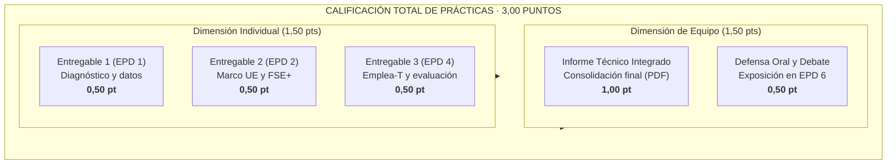

# Guía de Trabajo del Estudiante · Enseñanzas Prácticas y de Desarrollo (EPD)
## Políticas Sociolaborales y de Empleo (102023) · Curso 2026-27
### Grado en Relaciones Laborales y Recursos Humanos · Doble Grado en Derecho y RRLL-RRHH
### Universidad Pablo de Olavide · Departamento de Economía, Métodos Cuantitativos e Historia Económica

---

## 1. Bienvenida y Marco General de las Prácticas

Bienvenido/a a las Enseñanzas Prácticas y de Desarrollo (EPD) de **Políticas Sociolaborales y de Empleo (PSLL)**. A lo largo de este cuatrimestre no resolverás ejercicios teóricos aislados ni supuestos ficticios. Tu labor en el laboratorio informático consistirá en actuar como **Analista de Políticas Públicas de Empleo**, desarrollando un proyecto técnico real de principio a fin:

> **Título del Proyecto de Prácticas:**  
> *«Del diagnóstico a la acción: políticas sociolaborales frente al desempleo de larga duración y de las personas mayores de 45 años en Andalucía»*.

El desempleo que sufren las personas de más de 45 años y los parados de larga duración (más de 12 meses buscando empleo) constituye el nudo gordiano del mercado laboral andaluz y español: acumulan la mayor parte de las situaciones de exclusión laboral, sufren la obsolescencia de competencias y corren el riesgo de desconexión definitiva de la vida activa.

A través de las prácticas aprenderás a:
1. **Comprender e interpretar la realidad laboral** mediante las estadísticas oficiales de la Encuesta de Población Activa (EPA-INE) y Eurostat, identificando con claridad qué colectivos afrontan mayores dificultades de inserción.
2. **Conocer cómo funciona la financiación comunitaria:** cómo las prioridades de la Unión Europea y del Fondo Social Europeo Plus (FSE+) condicionan los programas de empleo en Andalucía.
3. **Analizar el impacto real de las políticas de empleo:** examinarás programas reales (como el Programa Talento 45+ de las Cámaras de Comercio y la Orden de 3 de octubre de 2024 del Programa Emplea-T de la Junta de Andalucía), utilizando simuladores visuales para ver cómo influyen en los costes de contratación de una empresa y valorando si logran crear empleo estable o pueden generar efectos no deseados en la plantilla.

---

## 2. Ponderación y Sistema de Evaluación Continua (30% de la Asignatura)

Las prácticas tienen una asignación de **3,00 puntos netos sobre 10 (30% de la nota final)** en la asignatura, con asistencia obligatoria a las sesiones de aula informática:

* **Nota Individual (1,50 puntos):** Obtenida mediante 3 entregables individuales que se realizan y validan directamente en el aula de informática durante las sesiones 1, 2 y 4 (0,50 puntos cada uno).
* **Nota Colectiva (1,50 puntos):** Elaborada en equipos de 3 o 4 estudiantes:
  * **Informe Técnico Final (1,00 punto):** Documento consolidado que integra los tres bloques de trabajo. En la portada del informe constará el nombre del estudiante responsable de la redacción principal de cada bloque.
  * **Defensa Oral y Debate (0,50 puntos):** Exposición pública y réplica crítica en la sesión 6.
* **Pasaporte de Evaluación Continua:** Todas las calificaciones y sellados de entrega se sincronizan de forma transparente en el Pasaporte Digital de la asignatura.

---

## 3. La Web App Oficial de EPD y tu Código Personal UPO

Para garantizar una experiencia ágil, homogénea y tecnológicamente avanzada, todo el trabajo de laboratorio se articula a través de la **Web App Oficial de EPD de PSLL**:

🌐 **Dirección de acceso:** `https://mhidper.github.io/micro_apps/epd_laboratorio.html`

### ¿Cómo te identificas?
1. **Tu Acrónimo Institucional UPO:** En la pantalla inicial de la web, introduce tu acrónimo oficial de acceso a los servicios de la Universidad Pablo de Olavide (el mismo que utilizas en los Servicios Personales o Aula Virtual; ej. `sagudel`, `laltucl`, etc.).
2. **Generación del Código EPD Permanente:** La primera vez que entres con tu acrónimo, la plataforma te generará y mostrará tu **Código de Estación EPD** (con formato `PSLL-EPD-XXXX`).
   * **¡IMPORTANTE!** Este código es personal, intransferible y permanente. Guárdalo o anótalo en tus notas personales. A partir de esa primera sesión, podrás utilizarlo para identificarte y desbloquear tu estación de trabajo en cualquier momento.
3. **Asignación Dinámica de Caso:** Al autenticarte, tu código desbloquea de forma automática **tu caso específico de análisis**: una cohorte sociodemográfica asignada (tramo de edad y género), un ámbito territorial de contraste (Andalucía frente a España o un estado miembro de la UE) y una ventana temporal de referencia.

### Registro de Actividad y Telemetría Docente
El profesorado dispone de un cuadro de mandos docente conectado con la plataforma que registra de forma automática:
* Las fechas y horas exactas en las que inicias sesión y trabajas en la web.
* El tiempo efectivo de permanencia en la resolución del laboratorio.
* El progreso de validación de cálculos en cada fase y el sellado temporal final de tus entregables.

---

## 4. Política de Integridad Académica y Controles Tecnológicos Anti-IA

El uso no autorizado de herramientas de Inteligencia Artificial Generativa (ChatGPT, Claude, Copilot, etc.) para la redacción o resolución automática de las tareas de prácticas está expresamente desestimado y neutralizado por el diseño técnico del sistema:

1. **Casos Paramétricos Únicos:** Cada estudiante trabaja con parámetros y datos distintos asignados a su código personal. Un prompt generalista a una IA producirá datos que no coincidirán con los de tu estación de trabajo.
2. **Microdatos en DOM Local:** Los datos estadísticos oficiales están embebidos en componentes dinámicos de la web; la IA externa no tiene acceso al estado de tu sesión ni a tus gráficos interactivos.
3. **Validación Aritmética en Tiempo Real:** La plataforma verifica matemáticamente la exactitud de tus cálculos empíricos antes de permitirte redactar la conclusión. Si introduces datos inventados o alucinados por una IA, la plataforma bloqueará el avance.
4. **Detección de Pegado Masivo (*Clipboard Trap*):** Las cajas de texto de redacción técnica cuentan con detectores activos de eventos de pegado (`paste`) y monitorización de velocidad de tecleo (WPM). Se prohíbe el volcado masivo de textos pre-redactados desde fuentes externas. La redacción debe ser tuya, construida progresivamente desde el teclado.
5. **Sellado Criptográfico:** Al concluir la tarea, la web genera un comprobante oficial firmado con un hash SHA-256 que certifica la autoría individual y la hora exacta de finalización dentro del aula.

---

## 5. Hoja de Ruta de Prácticas: Indicaciones Sesión por Sesión

---

### Sesión EPD 1 · Radiografía de la Situación: ¿Qué Dicen los Datos?
* **Semana 4** · *Laboratorio Digital Autoguiado Anti-IA*.
* **Objetivo:** Contrastar con los datos oficiales de la EPA y Eurostat los titulares habituales de prensa sobre el desempleo juvenil y sénior, descubriendo qué ocurre realmente en Andalucía frente a España y Europa.
* **Instrucciones paso a paso en la Web App:**
  1. *Fase 1 (00–15 min) · Activación:* Accede a la web con tu acrónimo UPO, obtén tu Código EPD y visualiza la vídeo-píldora introductoria del profesor.
  2. *Fase 2 (15–50 min) · Exploración Visual:* Utiliza los filtros sencillos de la web para consultar la situación de tu colectivo asignado. Comprueba visualmente cuántas personas están desempleadas y cuántas llevan más de 1 o 2 años buscando empleo.
  3. *Fase 3 (50–70 min) · Checkpoint Guiado:* Introduce en el validador interactivo los valores clave identificados (la web te confirmará si vas por el camino correcto).
  4. *Fase 4 (70–90 min) · Valoración Laboral y Cierre:* Redacta una breve síntesis razonada (200-250 palabras) explicando si el desempleo de tu colectivo se debe a una situación transitoria o si existen barreras estructurales (como el desánimo o la pérdida de competencias).
* **Entregable Evaluado:** **Entregable Individual 1 (0,50 puntos)**, validado directamente en la Web App al terminar la sesión.

---

### Sesión EPD 2 · Dimensión Europea del Reto: Del Compromiso Político al FSE+
* **Semana 7** · *Sesión presencial en aula informática*.
* **Objetivo:** Comprender cómo se conectan las prioridades sociales de la Unión Europea con los presupuestos y medidas que se aplican sobre el terreno en Andalucía.
* **Instrucciones operativas:**
  1. Identifica las recomendaciones de empleo que la Unión Europea traslada a España para apoyar a los colectivos con mayores dificultades de inserción.
  2. Conoce qué tipo de actuaciones financia prioritariamente el Fondo Social Europeo Plus (FSE+) para parados de larga duración y personas de más edad.
  3. Comprueba cómo se distribuyen los fondos en el Programa FSE+ de Andalucía 2021-2027 y la elevada tasa de cofinanciación comunitaria que recibe la comunidad autónoma (85%).
* **Entregable Evaluado:** **Entregable Individual 2 (0,50 puntos)**: Esquema visual de la cadena de financiación y justificación de por qué se necesitan programas específicos para estos colectivos.

---

### Sesión EPD 3 · Políticas Activas de Empleo: Enfoque Comparado y Programa Talento 45+
* **Semana 9** · *Sesión presencial en aula informática*.
* **Objetivo:** Comparar en qué medidas de empleo invierte España frente a países como Alemania o Francia (según la clasificación de la OCDE) y conocer de cerca un programa real de acompañamiento: *Talento 45+* (Cámaras de Comercio y FSE).
* **Instrucciones operativas:**
  1. *Comparativa internacional:* Observa las diferencias en el reparto de las ayudas: ¿se apoya más la formación y la orientación personalizada o las bonificaciones a la contratación?
  2. *Análisis del Programa Talento 45+:* Examina cómo se organiza el itinerario de ayuda al desempleado sénior (diagnóstico de competencias, reciclaje digital y búsqueda activa).
* **Hito de Trabajo:** **Checkpoint de Equipo (Borrador del Bloque 3 - Parte I)**. Validación en aula de las notas compartidas que formarán parte del informe final.

---

### Sesión EPD 4 · Incentivos a la Contratación: Análisis Práctico del Programa Emplea-T
* **Semana 10** · *Sesión presencial en aula informática*.
* **Objetivo:** Conocer y aplicar una normativa real de la Consejería de Empleo: la Orden de 3 de octubre de 2024 del Programa Emplea-T, simulando su repercusión económica en una empresa y analizando los requisitos contractuales exigidos.
* **Instrucciones operativas:**
  1. Utiliza el simulador de la web para calcular cuánto dinero ahorra la empresa con la subvención según el salario de convenio y el colectivo contratado (mayores de 45 años o desempleados de larga duración).
  2. Analiza las condiciones de la norma: ¿qué requisitos de mantenimiento del empleo durante 12 meses se exigen a la empresa para no tener que devolver la ayuda?
  3. Reflexiona desde la perspectiva de la gestión de personas: ¿es un incentivo suficiente para contratar a personas sénior? ¿podría la empresa caer en la tentación de rotar trabajadores?
* **Entregable Evaluado:** **Entregable Individual 3 (0,50 puntos)**: Ficha práctica con los cálculos del simulador y una valoración laboral aplicada sobre la orden.

---

### Sesión EPD 5 · Taller Integrador y Clínica de Informes
* **Semana 11** · *Sesión presencial en aula informática*.
* **Objetivo:** Asegurar la coherencia analítica del informe técnico de equipo, integrar los tres bloques temáticos y preparar el soporte de la defensa oral.
* **Instrucciones operativas:**
  1. Ensamblaje del borrador conjunto: verificar que las conclusiones del Bloque 3 responden directamente al diagnóstico del Bloque 1 y al marco financiero del Bloque 2.
  2. Redacción conjunta del apartado crucial: *«Propuestas y Recomendaciones Técnicas de Política Sociolaboral para Andalucía»*.
  3. Revisión cruzada con la Rúbrica Oficial de Evaluación y ensayo de tiempos de intervención para la presentación oral.

---

### Sesión EPD 6 · Presentaciones Finales, Debate Comparado y Cierre
* **Semana 12** · *Sesión plenaria de defensas*.
* **Dinámica de la sesión:**
  * Cada equipo dispone de un turno improrrogable de **8 a 10 minutos** para exponer sus hallazgos y defender sus propuestas mediante soporte visual estructurado.
  * Turno de preguntas y réplica crítica (3 a 5 minutos) por parte del docente y de los equipos oponentes.
  * Todos los miembros del equipo intervienen obligatoriamente defendiendo la sección de la que han sido redactores principales.
* **Entregables Finales Evaluados:**
  * **Informe Técnico Final en PDF (1,00 punto):** Subida al Aula Virtual del documento completo y maquetado.
  * **Defensa Oral y Debate (0,50 puntos):** Calificación individual basada en solvencia técnica, claridad expositiva y rigor en las réplicas.

---

### *Sesión Complementaria EPD 7 (Exclusiva Línea 2)*
* **Semana 13:** Clínica de retorno cualitativo personalizado sobre los informes finales y resolución de supuestos prácticos de preparación para el examen oficial de Enseñanzas Básicas (70%).

---

## 6. Organización de los Equipos de Trabajo

* **Tamaño del equipo:** 3 o 4 estudiantes matriculados en el mismo grupo de prácticas.
* **Asignación nominativa de responsabilidades:**
  * Estudiante A: Responsable del **Bloque 1** (Diagnóstico empírico y datos EPA/Eurostat).
  * Estudiante B: Responsable del **Bloque 2** (Gobernanza comunitaria y fondos FSE+).
  * Estudiante C: Responsable del **Bloque 3** (Políticas activas, Talento 45+ y Orden Emplea-T).
  * Estudiante D (si el equipo es de 4): Responsable de la **Evaluación de Impacto y Diseño de la Propuesta de Reforma**.
* **Capitanía Rotatoria:** En cada sesión un miembro actúa como Capitán para dinamizar el cumplimiento de los tiempos y verificar que todos los miembros han completado sus validaciones antes de abandonar el laboratorio.

---

## 7. Consejos para Superar con Éxito las Prácticas

1. **Ven con los conceptos de teoría (EB) frescos:** Las EPD aplican directamente las teorías y mecanismos explicados en las sesiones teóricas (tasas, flujos, histéresis, efectos de los subsidios).
2. **No dejes las tareas para el final de la sesión:** La web cierra el registro de entrega al expirar la ventana horaria oficial de la clase. Trabaja de forma constante desde el minuto 1.
3. **El rigor cuantitativo es innegociable:** Toda afirmación sociolaboral debe estar sustentada en un dato numérico preciso, con su unidad (%) y su fuente oficial citada.
4. **Guarda tu Código EPD:** Es la llave de tu estación de trabajo y tu pasaporte de evaluación a lo largo de todo el semestre.
