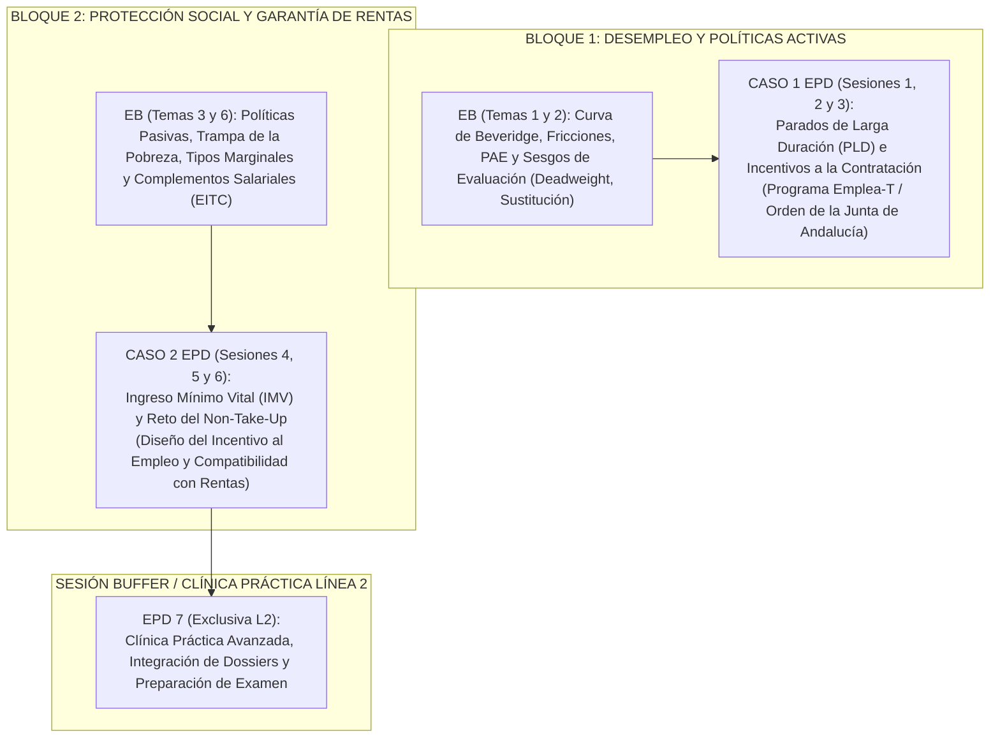

# Cronograma Docente Coordinado e Integrado: PSLL 2026-27
## Políticas Sociolaborales y de Empleo (Código 102023)
### Grado en Relaciones Laborales y Recursos Humanos / Doble Grado en Derecho y RRLL-RRHH
**Universidad Pablo de Olavide (UPO) — Curso Académico 2026-2027 (Primer Semestre: 14/09/2026 – 20/12/2026)**

---

## 1. Principios de Coordinación y Arquitectura del Curso

Este cronograma garantiza una **coordinación simétrica y en paralelo** entre la **Línea 1 (Mañana)** y la **Línea 2 (Tarde)**, asegurando que ambas cohortes avancen al mismo ritmo cognitivo y que cada sesión práctica de **Enseñanzas Prácticas y de Desarrollo (EPD)** esté precedida por el marco teórico y causal impartido en las **Enseñanzas Básicas (EB)**.

### Estructura de Grupos, Aulas y Horarios Oficiales

| Parámetro | Línea 1 (Turno de Mañana) | Línea 2 (Turno de Tarde) |
| :--- | :--- | :--- |
| **Aula Principal EB** | **Aula E13A7** (Edif. 13, Aula 7 — Mobiliario móvil) | **Aula E10A3** (Edif. 10, Aula 3) |
| **Horario Habitual EB** | • **Lunes**: 13:30 – 15:00 (1,5 h) • **Martes**: 09:30 – 11:30 (2,0 h) | • **Lunes**: 20:00 – 21:30 (1,5 h) • **Viernes**: 17:30 – 19:30 (2,0 h) |
| **Aulas Informática EPD** | • **EPD 11**: Aula **E24AINFB01** (Edif. 24, B.01) • **EPD 12**: Aula **E14AINF1** (Edif. 14, Aula 1) | • **EPD 21**: Aula **E10AINF6** (Edif. 10, Aula 6) |
| **Horario Habitual EPD** | • **EPD 12**: Lunes 13:30 – 15:00 • **EPD 11**: Martes 11:30 – 13:00 *(tras EB)* | • **EPD 21**: Viernes 19:30 – 21:00 *(inmediatamente tras EB)* |
| **Total Sesiones EPD** | **6 sesiones** de 1,5 horas (9 horas presenciales) | **7 sesiones** de 1,5 horas (10,5 horas presenciales) |

---

## 2. Alineación Pedagógica EB ⇄ EPD: El Método del Caso

La docencia práctica en EPD se estructura en torno a **dos casos reales de diseño y evaluación de políticas públicas**, directamente alimentados por las sesiones teóricas previas de EB:

### El Desfase de Sesiones de EPD (L1 = 6 vs. L2 = 7) y su Solución Docente
1. **Línea 1 (6 sesiones):**
   - **Caso 1 (Incentivos a la contratación PLD):** Sesiones 1, 2 y 3.
   - **Caso 2 (Ingreso Mínimo Vital e Incentivo al Empleo):** Sesiones 4, 5 y 6 (la sesión 6 integra la evaluación y entrega final del dossier).
2. **Línea 2 (7 sesiones):**
   - **Caso 1:** Sesiones 1, 2 y 3.
   - **Caso 2:** Sesiones 4, 5 y 6.
   - **Sesión 7 (Ajuste Pedagógico):** Se destina a **"Clínica Práctica de Políticas Públicas y Simulación de Evaluación"**. Funciona como sesión colchón (*buffer*) para compensar el impacto de festivos en turno de tarde, realizar la defensa cruzada de los dos informes técnicos (*dossiers*) y resolver dudas analíticas previas a la prueba escrita. De este modo, los estudiantes de L1 no quedan perjudicados en contenido y los de L2 aprovechan al máximo su hora y media adicional de taller.

---

## 3. Matriz Semanal de Coordinación en Paralelo (Semanas 1 a 14)

A continuación se detalla la programación semanal integrada. Se indica para cada franja lectiva la fecha, aula, materia abordada en EB y fase del caso trabajada en EPD.

| Sem. | Fechas | Línea 1 (Mañana) | Línea 2 (Tarde) | Contenido Temático EB | Dinámica y Tareas EPD |
| :---: | :---: | :--- | :--- | :--- | :--- |
| **1** | 14/09 – 18/09 | • L 14/09 (13:30-15:00) Aula E13A7 • M 15/09 (09:30-11:30) Aula E13A7 | • L 14/09 (20:00-21:30) Aula E10A3 • V 18/09 (17:30-19:30) Aula E10A3 | **Tema 0 y 1:** Presentación de la materia, método del caso y concepto de flujos/stocks en el mercado de trabajo (EPA). | *Sin EPD.* Presentación del método de trabajo y conformación de equipos de análisis. |
| **2** | 21/09 – 25/09 | • L 21/09 (13:30-15:00) Aula E13A7 • M 22/09 (09:30-11:30) Aula E13A7 | • L 21/09 (20:00-21:30) Aula E10A3 • V 25/09 (17:30-19:30) Aula E10A3 | **Tema 1:** Desequilibrios, desajuste (mismatch) y Curva de Beveridge (fricciones vs. eficiencia). | *Sin EPD.* Lectura previa guiada sobre parados de larga duración (PLD). |
| **3** | 28/09 – 02/10 | • M 29/09 (09:30-11:30) Aula E13A7 • X 30/09 (12:00-13:30) Aula E13A7 *(ajuste)* | • L 28/09 (20:00-21:30) Aula E10A3 • V 02/10 (17:30-19:30) Aula E10A3 | **Tema 2:** Políticas Activas de Empleo (PAE) I: Justificación de la intervención, tipologías e intermediación. | *Sin EPD.* Entrega en Aula Virtual de la Orden de subvenciones al empleo (Junta de Andalucía). |
| **4** | 05/10 – 09/10 | • L 05/10 (13:30-15:00) Aula E13A7 • M 06/10 (09:30-11:30) Aula E13A7 | • L 05/10 (20:00-21:30) Aula E10A3 • V 09/10 (17:30-19:30) Aula E10A3 | **Tema 2:** Políticas Activas de Empleo (PAE) II: Evaluación de impacto, sesgo de selección y efectos de peso muerto (*deadweight*). | *Sin EPD.* Preparación de datos empíricos para la primera sesión en aula de informática. |
| **5** | 12/10 – 16/10 | • M 13/10 (09:30-11:30) Aula E13A7 *(L 12/10 Festivo Nac. Hispanidad)* | • V 16/10 (17:30-19:30) Aula E10A3 | **Tema 2:** Articulación de incentivos a la contratación y programas de fomento de empleo en España y Andalucía. | **EPD 1 (Inicio Caso 1):** • *L1:* M 13/10 (11:30-13:00) EPD11 (E24AINFB01) / Lunes festivo compensado. • *L2:* V 16/10 (19:30-21:00) EPD21 (E10AINF6). **Tarea:** Diagnóstico empírico de PLD con microdatos EPA/SEPE y segmentación de perfiles. |
| **6** | 19/10 – 23/10 | • L 19/10 (13:30-15:00) Aula E13A7 • M 20/10 (09:30-11:30) Aula E13A7 | • L 19/10 (20:00-21:30) Aula E10A3 • V 23/10 (17:30-19:30) Aula E10A3 | **Tema 3:** Políticas Pasivas de Empleo y Protección por Desempleo: Tasa de sustitución, riesgo moral y duración. | *Sin EPD.* Trabajo autónomo de equipos: formulación de propuestas técnicas para el subsidio de contratación. |
| **7** | 26/10 – 30/10 | • M 27/10 (09:30-11:30) Aula E13A7 | • V 30/10 (17:30-19:30) Aula E10A3 | **Tema 3:** La trampa de la pobreza y desincentivos al trabajo: Tipos marginales efectivos de gravamen (METR). | **EPD 2 (Caso 1 - Fase Técnica):** • *L1:* L 26/10 (13:30-15:00) EPD12 (E14AINF1) / M 27/10 (11:30-13:00) EPD11 (E24AINFB01). • *L2:* V 30/10 (19:30-21:00) EPD21 (E10AINF6). **Tarea:** Calibración microeconómica de las cuantías del incentivo y redacción de cláusulas anti-sustitución. |
| **8** | 02/11 – 06/11 | • M 03/11 (09:30-11:30) Aula E13A7 *(L 02/11 Festivo Todos los Santos)* | • V 06/11 (17:30-19:30) Aula E10A3 | **Tema 3:** El sistema de Garantía de Rentas Mínimas en España: De las RMI autonómicas al Ingreso Mínimo Vital (IMV). | *Sin EPD.* Consolidación de resultados de la simulación del Caso 1. |
| **9** | 09/11 – 13/11 | • M 10/11 (09:30-11:30) Aula E13A7 | • V 13/11 (17:30-19:30) Aula E10A3 | **Tema 4:** Flexibilidad, Costes de Despido (EPL) y Dualidad Laboral: Fijos vs. temporales tras la reforma 2021. | **EPD 3 (Cierre Caso 1):** • *L1:* L 09/11 (13:30-15:00) EPD12 (E14AINF1) / M 10/11 (11:30-13:00) EPD11 (E24AINFB01). • *L2:* V 13/11 (19:30-21:00) EPD21 (E10AINF6). **Tarea:** Estimación cuantitativa del peso muerto, coste-eficacia y **entrega del Dossier 1 (Emplea-T)**. |
| **10** | 16/11 – 20/11 | • L 16/11 (13:30-15:00) Aula E13A7 • M 17/11 (09:30-11:30) Aula E13A7 | • L 16/11 (20:00-21:30) Aula E10A3 • V 20/11 (17:30-19:30) Aula E10A3 | **Tema 5:** Negociación Colectiva y Fijación Salarial: Centralización vs. descentralización y salarios de eficiencia. | *Sin EPD.* Lanzamiento de los materiales del Caso 2: Auditoría del IMV y datos del informe AIReF. |
| **11** | 23/11 – 27/11 | • M 24/11 (09:30-11:30) Aula E13A7 | • V 27/11 (17:30-19:30) Aula E10A3 | **Tema 6:** Desigualdad Salarial, Pobreza Laboral (*Working Poor*) y Salario Mínimo Interprofesional (SMI). | **EPD 4 (Inicio Caso 2 - IMV):** • *L1:* L 23/11 (13:30-15:00) EPD12 (E14AINF1) / M 24/11 (11:30-13:00) EPD11 (E24AINFB01). • *L2:* V 27/11 (19:30-21:00) EPD21 (E10AINF6). **Tarea:** Diagnóstico empírico de la cobertura del IMV, análisis del *non-take-up* y barreras burocráticas. |
| **12** | 30/11 – 04/12 | • M 01/12 (09:30-11:30) Aula E13A7 | • V 04/12 (17:30-19:30) Aula E10A3 | **Tema 6 y 7:** Complementos Salariales (EITC), incentivo al empleo y sostenibilidad de rentas garantizadas. | **EPD 5 (Caso 2 - Incentivo al Empleo):** • *L1:* L 30/11 (13:30-15:00) EPD12 (E14AINF1) / M 01/12 (11:30-13:00) EPD11 (E24AINFB01). • *L2:* V 04/12 (19:30-21:00) EPD21 (E10AINF6). **Tarea:** Diseño de la fórmula de compatibilidad empleo-IMV y reducción de la tasa de retirada del subsidio. |
| **13** | 07/12 – 11/12 | *(L 07/12 Puente Const. / M 08/12 Festivo Inmaculada)* • Cierre y tutorías telemáticas de EB | • V 11/12 (16:00-18:00) Aula E10A3 *(recuperación EB 2 h)* | **Tema 7:** Sostenibilidad del Sistema de Pensiones y Reto Demográfico (Reparto vs. capitalización). | **EPD 6 (Evaluación Caso 2) + EPD 7 (L2):** • *L1:* Cierre telemático / entrega definitiva **Dossier 2 (IMV)** (Sesión 6 de L1). • *L2:* V 11/12 (18:00-19:30) **EPD 6** (Evaluación Caso 2) + V 11/12 (19:30-21:00) **EPD 7 (Clínica y Defensa Final L2)**. |
| **14** | 14/12 – 18/12 | • M 15/12 (09:30-11:30) Aula E13A7 • X 16/12 (12:00-13:30) Aula E13A7 | • L 14/12 (20:00-21:30) Aula E10A3 • V 18/12 (17:30-19:30) Aula E10A3 | **Tema 7:** Síntesis global de políticas sociolaborales, balance comparado y preparación de la evaluación final. | *Sin EPD.* Sesiones plenarias de síntesis y resolución de casos tipo examen. |

---

## 4. Desarrollo Operativo y Fichas de Sesión EPD

### BLOQUE I: CASO 1 — Parados de Larga Duración e Incentivos a la Contratación (Programa Emplea-T)

#### EPD 1 (Semana 5: 12-16 Octubre) · *Diagnóstico y Segmentación del Paro Estructural*
- **Objetivo analítico:** Comprender por qué las vacantes no se casan con los demandantes de empleo de larga duración (curva de Beveridge) y caracterizar la población diana en Andalucía.
- **Herramienta de trabajo:** Tablas dinámicas y microdatos agregados de EPA (INE) y paro registrado (SEPE/SAE).
- **Entregable en clase:** Matriz de diagnóstico de barreras de empleabilidad (edad >45 años, baja cualificación, tiempo en desempleo >12 meses).

#### EPD 2 (Semana 7: 26-30 Octubre) · *Diseño Técnico y Calibración de la Subvención*
- **Objetivo analítico:** Diseñar la cuantía y estructura del incentivo a la contratación para minimizar distorsiones en el mercado de trabajo.
- **Aspectos a calibrar:**
  - ¿Subvención fija a tanto alzado vs. bonificación porcentual de cuotas a la Seguridad Social?
  - Cláusulas de permanencia (mínimo 12 meses o 24 meses) y cláusula de empleo neto anti-despido.
- **Entregable en clase:** Borrador de los Artículos 4 y 5 de la Orden simulada (requisitos y cuantías escalonadas).

#### EPD 3 (Semana 9: 09-13 Noviembre) · *Evaluación de Impacto y Cierre del Dossier 1*
- **Objetivo analítico:** Cuantificar el coste presupuestario real descontando el efecto de peso muerto (*deadweight loss*, contrataciones que se habrían hecho igualmente) y el efecto sustitución.
- **Herramienta:** Hoja de cálculo de simulación coste-beneficio y cálculo del coste neto por empleo adicional generado.
- **Hito de evaluación:** **Entrega formal del Informe Técnico 1 (Dossier Emplea-T)** (30% de la nota continua).

---

### BLOQUE II: CASO 2 — El Ingreso Mínimo Vital (IMV) y el Incentivo al Empleo

#### EPD 4 (Semana 11: 23-27 Noviembre) · *Diagnóstico del IMV y el Problema del Non-Take-Up*
- **Objetivo analítico:** Evaluar la eficacia protectora del IMV frente a la pobreza severa y analizar las causas por las que un 40-50% de los hogares potenciales no lo solicitan o no lo perciben (*non-take-up*).
- **Materiales de trabajo:** Informes anuales de la AIReF sobre el IMV y microdatos de la Encuesta de Condiciones de Vida (ECV).
- **Entregable en clase:** Diagnóstico de barreras de acceso: brecha digital, estigmatización y complejidad del test de patrimonio/ingresos pasados.

#### EPD 5 (Semana 12: 30 Noviembre - 04 Diciembre) · *Diseño del Incentivo al Empleo (Compatibilidad Rentas-Trabajo)*
- **Objetivo analítico:** Eliminar el tipo marginal implícito del 100% (donde ganar 1 € en el mercado laboral descuenta 1 € de la prestación) mediante un esquema tipo *Earned Income Tax Credit* (EITC).
- **Aspectos a calibrar:**
  - Tramo 1: Exención total (100% compatible hasta cierto umbral).
  - Tramo 2: Retirada progresiva del subsidio (tasa marginal de desestímulo reducida al 30-40%).
- **Entregable en clase:** Gráfico y fórmula matemática de la restricción presupuestaria individual con y sin incentivo al empleo.

#### EPD 6 (Semana 13: 07-11 Diciembre) · *Evaluación Presupuestaria y Cierre del Dossier 2*
- **Objetivo analítico:** Estimar el impacto sobre la oferta de horas de trabajo y el balance fiscal de la reforma del incentivo al empleo del IMV.
- **Hito de evaluación común (L1 y L2):** **Entrega formal del Informe Técnico 2 (Dossier IMV)** (30% de la nota continua).

#### EPD 7 (Semana 13: Viernes 11 Diciembre, 19:30-21:00) · *Sesión Exclusiva Línea 2: Clínica Práctica y Defensa de Dossiers*
- **Justificación de la sesión adicional:** Conforme al calendario oficial de la Línea 2, este grupo dispone de una 7ª sesión de EPD. Se aprovecha este espacio para:
  1. Realizar una **ronda de defensa oral rápida por parejas/grupos** de las propuestas del Caso 1 y Caso 2.
  2. Efectuar una **clínica analítica de resolución de dudas técnicas** y simulacro de preguntas prácticas aplicadas para la prueba final de la asignatura.
  3. Servir de amortiguador (*buffer*) ante las pérdidas de sesiones de EB por el calendario festivo de viernes tarde.

---

## 5. Ponderación en el Sistema de Evaluación Continua

| Instrumento de Evaluación | Peso | Carácter | Vínculo con las Sesiones |
| :--- | :---: | :---: | :--- |
| **Dossier Técnico 1 (Caso Emplea-T / PLD)** | **30%** | Grupal / Aplicado | Elaborado en EPD 1, 2 y 3. Entrega en Semana 9. |
| **Dossier Técnico 2 (Caso IMV / Incentivo Empleo)** | **30%** | Grupal / Aplicado | Elaborado en EPD 4, 5 y 6. Entrega en Semana 13. |
| **Participación Activa y Retos Semanales (EB + EPD)** | **10%** | Individual | Micro-debates en EB y dinámicas de clase interactiva. |
| **Examen Final Teórico-Práctico Sintético** | **30%** | Individual | Prueba oficial de integración de conceptos macro y analíticos. |

---

## 6. Verificación y Cumplimiento del Calendario Académico UPO

- **Periodo lectivo cubierto:** Del 14 de septiembre de 2026 al 20 de diciembre de 2026.
- **Festivos nacionales y autonómicos respetados:**
  - Lunes 12/10/2026: Fiesta Nacional de España (Hispanidad).
  - Lunes 02/11/2026: Traslado de Todos los Santos.
  - Lunes 07/12/2026 y Martes 08/12/2026: Puente de la Constitución y Festividad de la Inmaculada.
- **Sincronización:** Ambos grupos terminan las entregas y el temario teórico de forma paralela en la semana 13-14, garantizando equidad académica plena antes de los exámenes oficiales de enero.
