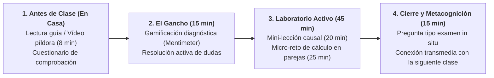

# Guion de Sesión EB 1 · Semana 1 (Lunes 14/09/2026)
## Presentación de la Asignatura y Fundamentos del Mercado de Trabajo
**Asignatura:** Políticas Sociolaborales y de Empleo (Código 102023)  
**Curso Académico:** 2026-2027 | Semestre 1  
**Profesor:** Manuel A. Hidalgo Pérez  
**Archivo de guion:** `guion_sesion_1409_lunes.md`

---

## ⏱️ 1. Ficha Técnica de la Sesión

| Parámetro | Línea 1 (Mañana) | Línea 2 (Tarde) |
| :--- | :--- | :--- |
| **Día y Fecha** | Lunes, 14 de septiembre de 2026 | Lunes, 14 de septiembre de 2026 |
| **Horario y Duración** | **13:30 – 15:00** (90 minutos / 1,5 h) | **20:00 – 21:30** (90 minutos / 1,5 h) |
| **Aula Oficial** | **Aula E13A7** (Edif. 13, Aula 7) | **Aula E10A3** (Edif. 10, Aula 3) |
| **Material Base** | • [Tema 0 (Diapositivas)](file:///c:/Users/Usuario/Dropbox/DOCENCIA%20UPO/CURSO%2026-27/PSLL/Temas%20EB%20-%202526/Tema%200/Diapositivas/Tema%200.pdf) • [Tema 1 (Diapositivas 2627)](file:///c:/Users/Usuario/Dropbox/DOCENCIA%20UPO/CURSO%2026-27/PSLL/Temas%20EB%20-%202526/Tema%201/Diapositivas/Tema%201%202627.pptx) (Slides 1–15) • [Tema 1 (Apuntes)](file:///c:/Users/Usuario/Dropbox/DOCENCIA%20UPO/CURSO%2026-27/PSLL/Temas%20EB%20-%202526/Tema%201/Apuntes/Tema%201%202627.docx) |

---

## 📋 2. Tareas Pendientes para el Profesorado (Checklist previo)

- [ ] **Seleccionar y proyectar noticia disparadora del mercado laboral:**
  - *Propuesta del asistente:* Noticia EPA del último trimestre: *"España lidera la tasa de paro de la Unión Europea pero alcanza récord histórico de ocupados rozando los 21,8 millones"* (El País / Cinco Días).
  - *Pregunta clave asociada:* «¿Cómo es posible que haya más gente trabajando que nunca y al mismo tiempo sigamos teniendo la mayor tasa de desempleo de Europa?».
- [ ] **Configurar sondeo inicial en tiempo real (Mentimeter / Wooclap):**
  - Preparar 2 preguntas de intuición:
    1. *«¿Cuál crees que es la tasa de desempleo estructural mínima a la que puede aspirar España hoy en día?»* (Opciones: 3%, 6%, 10%, 14%).
    2. *«Si una persona en paro deja de buscar trabajo porque cree que no va a encontrar nada, ¿sigue contando como desempleada en las estadísticas oficiales?»* (Sí / No / No sabe).
- [ ] **Cargar en el Aula Virtual la Guía Docente y el Cronograma:**
  - Disponer del enlace a [cronograma/cronograma_psll_2026_27.md](file:///c:/Users/Usuario/Dropbox/DOCENCIA%20UPO/CURSO%2026-27/PSLL/cronograma/cronograma_psll_2026_27.md) para proyectar en los primeros 25 minutos.
- [ ] **Revisar proyector y audio del aula:**
  - Verificar conexión HDMI en Aula E13A7 (L1) y Aula E10A3 (L2).

---

## 🎯 3. Objetivos de Aprendizaje y Competencias Clave

1. **Inmersión en la Narrativa Transmedia y Rol Profesional:** El alumnado asume el rol de **analista técnico junior** en la *Unidad de Evaluación y Diseño de Políticas Sociolaborales* (Consejería de Empleo / Ministerio de Inclusión). El aula es el centro de operaciones donde se resuelven casos reales.
2. **Dominio Operativo de la Taxonomía EPA (INE/OIT):** Distinguir con precisión matemática y conceptual entre población total, en edad de trabajar (PET), activa (ocupados y parados) e inactiva.
3. **Dinámica de Flujos vs. Stocks:** Comprender que el mercado laboral es un sistema dinámico (bañera de flujos con entradas por despido/incorporación y salidas por colocación/desánimo/jubilación).

---

## 🔁 4. Estructura de Aula Invertida (*Flipped Classroom*) y Fases de la Sesión

Siguiendo las directrices pedagógicas del cuaderno de innovación docente de la asignatura:

### Fase 0: Antes de Clase · Trabajo Autónomo del Alumnado (En Casa)
- **Recurso digital provisto:** Píldora explicativa breve (vídeo de 7-9 minutos o infografía resumen) en el Aula Virtual: *«La arquitectura de la EPA: cómo se mide el empleo y el paro sin caer en trampas estadísticas»*.
- **Comprobación formativa automatizada:** Cuestionario de 3 preguntas de opción múltiple autocalificables en el campus virtual (Moodle). El docente recibe el mapa de calor de aciertos antes de entrar a clase para saber qué conceptos exigen refuerzo.

---

## ⏱️ 5. Desarrollo Minuto a Minuto en el Aula Presencial (90 min)

### Bloque 1: El Gancho y Gamificación Diagnóstica (00:00 – 00:20 · 20 min)
- **Actividad del Profesor (8 min):**
  - Bienvenida e inmersión en el rol profesional: *«Bienvenidos al equipo de evaluación de políticas públicas sociolaborales. Aquí no se memoriza legislación; se aprende a tomar decisiones con datos para cambiar la vida de las personas»*.
  - Proyección de la noticia disparadora en pantalla:
    > **«Récord histórico de afiliación a la Seguridad Social con 21,7 millones de ocupados mientras España duplica la tasa de paro media de la OCDE (11,3% frente a 4,9%)».**
- **Gamificación y Sondeo de Arranque (Mentimeter) (12 min):**
  - Los alumnos escanean el código QR desde sus móviles y responden a dos preguntas trampa:
    1. *«Si se crean 400.000 empleos en un año, ¿la tasa de paro baja obligatoriamente?»* (Sí / No / Depende de la población activa).
    2. *«¿Qué colectivo es numéricamente mayor en España: los parados registrados en el SEPE o los parados según la EPA?»*
  - El profesor analiza los resultados proyectados en tiempo real para calibrar el debate.

### Bloque 2: Mini-Lección Quirúrgica de Mecanismos Causales (00:20 – 00:45 · 25 min)
- **Exposición teórica focalizada (Diapositivas 1 a 12 del Tema 1 — paleta oficial menta/salvia/coral):**
  - Taxonomía estricta OIT/EPA:
    $$\text{Tasa de Actividad} = \frac{\text{Población Activa}}{\text{Población } \ge 16} \times 100$$
    $$\text{Tasa de Paro} = \frac{\text{Desempleados}}{\text{Población Activa}} \times 100$$
    $$\text{Tasa de Empleo} = \frac{\text{Ocupados}}{\text{Población } \ge 16} \times 100$$
  - **La trampa del desánimo:** Simulación de qué ocurre cuando 150.000 parados de larga duración dejan de renovar su demanda activa de empleo.
  - Diferencia metodológica entre paro registrado (administrativo, SEPE) y paro EPA (encuesta muestral homogénea internacional).

### Bloque 3: Laboratorio Activo · Reto de Simulación en Parejas (00:45 – 01:15 · 30 min)
- **Dinámica cooperativa (*Think-Pair-Share* en rol de evaluador):**
  - Se proyecta una matriz de datos reales/simulados de Andalucía para un trimestre.
  - **Misión del equipo:** Resolver el siguiente dictamen técnico en 15 minutos:
    - *«Durante el trimestre analizado, 40.000 graduados universitarios entran por primera vez a buscar trabajo; paralelamente se crean 35.000 empleos en el sector servicios y 25.000 desempleados mayores de 52 años pasan a la inactividad por desánimo. Determinad analíticamente si el gobierno autonómico puede anunciar que 'el desempleo ha mejorado' y explicad qué contradicciones detectáis»*.
  - **El profesor como facilitador:** Recorre el aula resolviendo dudas en los grupos mediante preguntas socráticas (no dando la respuesta directa).
- **Debriefing cruzado (15 min):** Dos parejas exponen su dictamen y se contrastan las conclusiones con el marco de evaluación de políticas públicas.

### Bloque 4: Cierre Metacognitivo y Pregunta Tipo Examen (01:15 – 01:30 · 15 min)
- **Pregunta Tipo Examen (Simulacro in situ de 3 minutos):**
  > *«En una economía, el gobierno aprueba una ayuda asistencial que exige a 100.000 personas inactivas inscribirse como demandantes de empleo. Si en ese periodo no se crea ni destruye ningún puesto de trabajo, determine y razone el impacto en la Tasa de Actividad, Tasa de Paro y Tasa de Empleo».*
- **Rúbrica ágil de corrección (proyectada en pantalla):**
  - $\uparrow$ Tasa de Actividad (aumenta el numerador y el denominador).
  - $\uparrow$ Tasa de Paro (aumenta el numerador en mayor proporción que el denominador).
  - $=$ Tasa de Empleo (los ocupados y la población $\ge 16$ no varían).
- **Conexión transmedia con la siguiente clase:**
  - Pista para la Sesión 2: *«El martes/viernes entraremos en la sala de máquinas del desempleo: ¿por qué los empresarios dicen que no encuentran trabajadores mientras hay 2,6 millones de personas en paro? La Curva de Beveridge os dará la respuesta»*.

---

## 📎 6. Material y Fuentes Propuestas para la Sesión

1. **Noticia recomendada:**
   - INE / Cinco Días (Último trimestre disponible): *«La paradoja del empleo en España: récord histórico de cotizantes con la mayor tasa de paro juvenil de la OCDE»*.
2. **Recurso transmedia en Aula Virtual:**
   - Píldora introductoria en vídeo (8 min) + infografía del árbol de clasificación EPA.
3. **Criterio de evaluación formativa del profesor:**
   - Registro ágil de participación y argumentación técnica durante el reto en parejas (evaluación in situ sin sobrecarga de corrección en casa).
