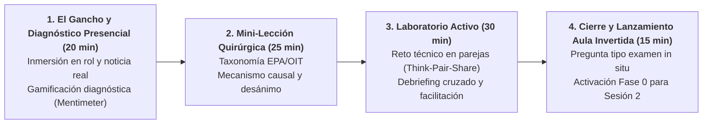

# Guion de Sesión EB 1 · Semana 1 (Lunes 14/09/2026)
## Presentación de la Asignatura y Fundamentos del Mercado de Trabajo
**Asignatura:** Políticas Sociolaborales y de Empleo (Código 102023)  
**Curso Académico:** 2026-2027 | Semestre 1  
**Profesor:** Manuel A. Hidalgo Pérez  
**Archivo de guion:** `guion_sesion_1409_lunes.md`

---

## ⏱️ 1. Ficha Técnica de la Sesión

| Parámetro | Línea 1 (Mañana) | Línea 2 (Tarde) |
| :--- | :--- | :--- |
| **Día y Fecha** | Lunes, 14 de septiembre de 2026 | Lunes, 14 de septiembre de 2026 |
| **Horario y Duración** | **13:30 – 15:00** (90 minutos / 1,5 h) | **20:00 – 21:30** (90 minutos / 1,5 h) |
| **Aula Oficial** | **Aula E13A7** (Edif. 13, Aula 7) | **Aula E10A3** (Edif. 10, Aula 3) |
| **Material Base** | • [Tema 0 (Diapositivas)](file:///c:/Users/Usuario/Dropbox/DOCENCIA%20UPO/CURSO%2026-27/PSLL/Temas%20EB%20-%202526/Tema%200/Diapositivas/Tema%200.pdf) • [Tema 1 (Diapositivas 2627)](file:///c:/Users/Usuario/Dropbox/DOCENCIA%20UPO/CURSO%2026-27/PSLL/Temas%20EB%20-%202526/Tema%201/Diapositivas/Tema%201%202627.pptx) (Bloques de Taxonomía EPA/OIT e Indicadores Básicos) • [Tema 1 (Apuntes)](file:///c:/Users/Usuario/Dropbox/DOCENCIA%20UPO/CURSO%2026-27/PSLL/Temas%20EB%20-%202526/Tema%201/Apuntes/Tema%201%202627.docx) (Sección 1: Fundamentos e Indicadores) |
| **Sistema de Puntuación** | Registro inicial en el **Pasaporte de Evaluación Continua** (acumulable sesión a sesión hacia el 10% de Participación Activa y Retos). |

---

## 📋 2. Tareas Pendientes para el Profesorado (Checklist previo)

- [ ] **Seleccionar y proyectar noticia disparadora del mercado laboral:**
  - *Propuesta del asistente:* Noticia EPA del último trimestre: *"España lidera la tasa de paro de la Unión Europea pero alcanza récord histórico de ocupados rozando los 21,8 millones"* (El País / Cinco Días).
  - *Pregunta clave asociada:* «¿Cómo es posible que haya más gente trabajando que nunca y al mismo tiempo sigamos teniendo la mayor tasa de desempleo de Europa?».
- [ ] **Configurar sondeo inicial en tiempo real (Mentimeter / Wooclap):**
  - Preparar 2 preguntas de intuición diagnóstica (con código QR proyectado en pantalla de bienvenida):
    1. *«¿Cuál crees que es la tasa de desempleo estructural mínima a la que puede aspirar España hoy en día?»* (Opciones: 3%, 6%, 10%, 14%).
    2. *«Si una persona en paro deja de buscar trabajo porque cree que no va a encontrar nada, ¿sigue contando como desempleada en las estadísticas oficiales?»* (Sí / No / No sabe).
- [ ] **Cargar en el Aula Virtual la Guía Docente, el Cronograma y el Pasaporte de Puntos:**
  - Disponer del enlace a [cronograma/cronograma_psll_2026_27.md](file:///c:/Users/Usuario/Dropbox/DOCENCIA%20UPO/CURSO%2026-27/PSLL/cronograma/cronograma_psll_2026_27.md) para proyectar en el encuadre inicial.
  - Habilitar en el libro de calificaciones de Moodle la columna del **Pasaporte de Competencias y Retos Semanales** (10% de evaluación continua).
- [ ] **Revisar proyector y audio del aula:**
  - Verificar conexión HDMI en Aula E13A7 (L1) y Aula E10A3 (L2).

---

## 🎯 3. Objetivos de Aprendizaje y Competencias Clave

1. **Inmersión en la Narrativa Transmedia y Rol Profesional:** El alumnado asume el rol de **analista técnico junior** en la *Unidad de Evaluación y Diseño de Políticas Sociolaborales*. El aula es el centro de operaciones donde se resuelven problemas con datos reales.
2. **Dominio Operativo de la Taxonomía EPA (INE/OIT):** Distinguir con rigor metodológico y conceptual entre población total, en edad de trabajar (PET $\ge 16$), activa (ocupados y parados) e inactiva.
3. **Dinámica de Flujos y Trampa del Desánimo:** Comprender que las tasas oficiales son ratios dinámicos y evaluar el impacto distorsionador del efecto desánimo sobre la tasa de paro.
4. **Activación del Sistema de Puntuación Acumulable:** Comprender las reglas del juego evaluativo: los retos presenciales y actividades virtuales suman puntos trazables hacia el 10% de participación activa a lo largo de las 14 semanas.

---

## 🔁 4. Estructura Pedagógica de la Sesión de Arranque (Día 1)

> **Nota metodológica para el Día 1:** Al ser la primera toma de contacto del semestre, **no existe tarea previa autónoma (Fase 0 fuera del aula)**. El diagnóstico competencial y la nivelación conceptual se realizan íntegramente de forma presencial. El modelo formal de *Flipped Classroom* (vídeo-píldora + micro-cuestionario previo) se presenta durante esta sesión y queda formalmente inaugurado para la Sesión 2.

---

## ⏱️ 5. Desarrollo Minuto a Minuto en el Aula Presencial (90 min)

### Bloque 1: El Gancho, Inmersión en Rol y Diagnóstico Presencial (00:00 – 00:20 · 20 min)
- **Actividad del Profesor (8 min):**
  - Bienvenida e inmersión en el rol profesional: *«Bienvenidos al equipo de evaluación de políticas públicas sociolaborales. Aquí no se memoriza legislación; se aprende a tomar decisiones con datos para cambiar la vida de las personas»*.
  - Proyección de la noticia disparadora en pantalla:
    > **«Récord histórico de afiliación a la Seguridad Social con 21,7 millones de ocupados mientras España duplica la tasa de paro media de la OCDE (11,3% frente a 4,9%)».**
- **Gamificación Diagnóstica en Vivo (Mentimeter) (12 min):**
  - Los alumnos escanean el código QR desde sus móviles y responden a dos preguntas trampa:
    1. *«Si se crean 400.000 empleos en un año, ¿la tasa de paro baja obligatoriamente?»* (Sí / No / Depende de la población activa).
    2. *«¿Qué colectivo es numéricamente mayor en España: los parados registrados en el SEPE o los parados según la EPA?»*
  - El profesor analiza los resultados proyectados en tiempo real para calibrar el nivel de partida y desmontar mitos habituales.

### Bloque 2: Mini-Lección Quirúrgica de Mecanismos Causales (00:20 – 00:45 · 25 min)
- **Exposición teórica focalizada (Bloque de Taxonomía EPA/OIT y Trampa del Desánimo — paleta oficial menta/salvia/coral):**
  - Taxonomía estricta OIT/EPA:
    $$\text{Tasa de Actividad} = \frac{\text{Población Activa}}{\text{Población } \ge 16} \times 100$$
    $$\text{Tasa de Paro} = \frac{\text{Desempleados}}{\text{Población Activa}} \times 100$$
    $$\text{Tasa de Empleo} = \frac{\text{Ocupados}}{\text{Población } \ge 16} \times 100$$
  - **La trampa del desánimo:** Simulación de qué ocurre cuando 150.000 parados de larga duración dejan de buscar activamente empleo y pasan a la inactividad.
  - Diferencia metodológica esencial entre paro registrado (registro administrativo voluntario, SEPE) y paro EPA (encuesta muestral homogénea según estándares OIT).

### Bloque 3: Laboratorio Activo · Reto Técnico en Parejas (00:45 – 01:15 · 30 min)
- **Dinámica cooperativa (*Think-Pair-Share* en rol de evaluador junior):**
  - Se proyecta una matriz de datos reales/simulados de Andalucía para un trimestre.
  - **Misión del equipo (15 min):** Resolver el siguiente dictamen técnico por parejas:
    - *«Durante el trimestre analizado, 40.000 graduados universitarios entran por primera vez a buscar trabajo; paralelamente se crean 35.000 empleos en el sector servicios y 25.000 desempleados mayores de 52 años pasan a la inactividad por desánimo. Determinad analíticamente si el gobierno autonómico puede anunciar que 'el desempleo ha mejorado' y explicad qué contradicciones detectáis»*.
  - **El profesor como facilitador:** Recorre el aula resolviendo dudas en los grupos mediante preguntas socráticas (no dando la respuesta directa, sino guiando el razonamiento sobre numeradores y denominadores).
- **Debriefing cruzado (15 min):** Dos parejas exponen su dictamen y se contrastan las conclusiones con el marco riguroso de evaluación de políticas públicas.

### Bloque 4: Cierre Metacognitivo, Pregunta Tipo Examen y Lanzamiento de Fase 0 (01:15 – 01:30 · 15 min)
- **Pregunta Tipo Examen (Simulacro individual de 3 minutos):**
  > *«En una economía, el gobierno aprueba una ayuda asistencial que exige a 100.000 personas inactivas inscribirse como demandantes de empleo. Si en ese periodo no se crea ni destruye ningún puesto de trabajo, determine y razone el impacto en: a) Tasa de Actividad, b) Tasa de Paro, y c) Tasa de Empleo».*

- **Clave de Corrección Completa (Proyectada in situ):**
  | Apartado | Solución Rigurosa | Errores Típicos a Anticipar en el Alumnado | Matiz para Distinguir Nota Excelente vs. Aceptable |
  | :--- | :--- | :--- | :--- |
  | **a) Tasa de Actividad** | **Aumenta ($\uparrow$).** La Población Activa ($A$) sube en 100.000 personas (pasan de inactivos a parados que buscan activamente). La Población en Edad de Trabajar (PET $\ge 16$) no cambia. Cociente $A / \text{PET}$ crece. | Decir que la actividad no cambia porque "no hay nuevos ocupados". Confunden actividad económica con ocupación. | *Aceptable:* Señala que sube porque hay más activos. *Excelente:* Formaliza que $\Delta A > 0$ con $\Delta \text{PET} = 0$, aumentando la ratio estrictamente. |
  | **b) Tasa de Paro** | **Aumenta ($\uparrow$).** El número de desempleados ($U$) sube en 100.000 y los activos ($A$) suben en 100.000. Como inicialmente $U < A$ (tasa de paro $< 100\%$), sumar la misma constante $k$ al numerador y al denominador incrementa obligatoriamente el cociente: $\frac{U+k}{A+k} > \frac{U}{A}$. | Afirmar erróneamente que la tasa de paro "no cambia" porque numerador y denominador suben en la misma cuantía. | *Aceptable:* Afirma que sube porque hay más parados. *Excelente:* Demuestra matemáticamente que $\frac{U+k}{A+k} > \frac{U}{A}$ para toda fracción propia ($U < A$) y explica el efecto llamada de la ayuda. |
  | **c) Tasa de Empleo** | **Permanece constante ($=$).** El número de ocupados ($O$) permanece invariable y la Población en Edad de Trabajar ($\text{PET} \ge 16$) no se altera. | Decir que la tasa de empleo "baja" creyendo erróneamente que Tasa de Paro + Tasa de Empleo deben sumar 100% (confunden denominadores: Activos vs. PET). | *Aceptable:* Indica que no cambia porque no hay despidos ni contrataciones. *Excelente:* Aclara explícitamente que los denominadores de ambas tasas son distintos ($A$ frente a $\text{PET}$), desmontando la falsa complementariedad al 100%. |

- **Asignación en el Pasaporte de Puntos:**
  - Quienes justifiquen con rigor los 3 apartados suman su primer registro positivo en el pasaporte de evaluación continua.
- **Lanzamiento de la Fase 0 para la Sesión 2:**
  - Explicación del funcionamiento de la clase invertida para la Sesión 2 (martes en L1 / viernes en L2): visionado del vídeo-píldora (10 min) y respuesta al micro-cuestionario diagnóstico de 3 preguntas en el Aula Virtual antes de entrar al aula.

---

## 📎 6. Material y Fuentes Propuestas para la Sesión

1. **Noticia recomendada:**
   - INE / Cinco Días (Último trimestre disponible): *«La paradoja del empleo en España: récord histórico de cotizantes con la mayor tasa de paro juvenil de la OCDE»*.
2. **Sistema de Evaluación Formativa y Gamificación Persistente:**
   - Registro de hitos en el **Pasaporte de Competencias y Retos Semanales** del Aula Virtual (computable dentro del 10% de evaluación continua). El baremo consolidado y la escala de insignias se detallan en la *Guía de Evaluación Continua de la Asignatura*.
3. **Actividad Opcional en Aula Virtual: «Preguntas Socráticas para Casa» (Incentivo de Participación):**
   - Espacio voluntario habilitado en el foro del Aula Virtual para profundizar tras la sesión presencial. Su realización rigurosa queda registrada en el pasaporte y aporta bonificación de nota continua.
   - **Batería de preguntas encadenadas (Sesión 1):**
     1. *Pregunta de partida:* Si la tasa de paro baja en un trimestre debido a que 200.000 personas dejan de buscar empleo y pasan a la inactividad por desánimo, ¿puede un responsable político sostener legítimamente que la situación laboral ha mejorado? ¿Qué indicador de la EPA desmonta esa afirmación y por qué?
     2. *Pregunta encadenada de profundización:* Si el desempleo baja artificialmente por desánimo pero la tasa de empleo permanece estancada, ¿qué consecuencias fiscales y de sostenibilidad financiera se derivan para la Seguridad Social a medio plazo?
     3. *Dilema de política pública:* Frente al efecto desánimo, ¿deberían los servicios públicos de empleo endurecer las sanciones y retirar subsidios a quienes no renueven la demanda, o bien diseñar itinerarios activos de acompañamiento intensivo para reincorporarlos a la población activa? Argumente los costes y riesgos de ambas alternativas.
