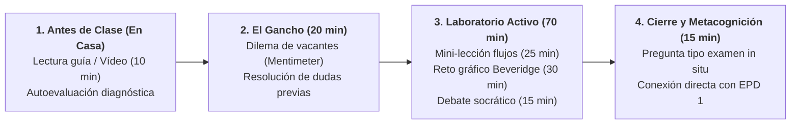

# Guion de Sesión EB 2 · Semana 1 (Martes 15/09 / Viernes 18/09)
## Flujos Dinámicos, Tipos de Desempleo y la Curva de Beveridge
**Asignatura:** Políticas Sociolaborales y de Empleo (Código 102023)  
**Curso Académico:** 2026-2027 | Semestre 1  
**Profesor:** Manuel A. Hidalgo Pérez  
**Archivo de guion:** `guion_sesion_1409_martes.md`

---

## ⏱️ 1. Ficha Técnica de la Sesión

| Parámetro | Línea 1 (Turno de Mañana) | Línea 2 (Turno de Tarde) |
| :--- | :--- | :--- |
| **Día y Fecha** | **Martes, 15 de septiembre de 2026** | **Viernes, 18 de septiembre de 2026** |
| **Horario y Duración** | **09:30 – 11:30** (**120 minutos / 2,0 h**) | **17:30 – 19:30** (**120 minutos / 2,0 h**) |
| **Aula Oficial** | **Aula E13A7** (Edif. 13, Aula 7) | **Aula E10A3** (Edif. 10, Aula 3) |
| **Material Base** | • [Tema 1 (Diapositivas 2627)](file:///c:/Users/Usuario/Dropbox/DOCENCIA%20UPO/CURSO%2026-27/PSLL/Temas%20EB%20-%202526/Tema%201/Diapositivas/Tema%201%202627.pptx) (Slides 13–40) • [Tema 1 (Apuntes)](file:///c:/Users/Usuario/Dropbox/DOCENCIA%20UPO/CURSO%2026-27/PSLL/Temas%20EB%20-%202526/Tema%201/Apuntes/Tema%201%202627.docx) (Secciones 2 y 3) |

> **Nota de coordinación:** Aunque el nombre de archivo toma por convención el martes de la Línea 1 (`guion_sesion_1409_martes.md`), este guion aplica con idéntica duración (120 min) y contenido a la sesión de tarde de la Línea 2 (viernes 18/09).

---

## 📋 2. Tareas Pendientes para el Profesorado (Checklist previo)

- [ ] **Seleccionar noticia disparadora sobre la "Paradoja de las Vacantes":**
  - *Propuesta del asistente:* Informe del Banco de España / Noticia económica: *"Las empresas declaran más de 150.000 vacantes sin cubrir mientras España supera los 2,6 millones de desempleados"* (El Economista / Cinco Días).
  - *Pregunta clave asociada:* «Si faltan camareros, informáticos y albañiles, ¿por qué el mercado no ajusta los salarios o por qué no se cubren esos puestos con los desempleados existentes?».
- [ ] **Preparar gráfico en vivo o diapositiva de la "Bañera del Desempleo":**
  - Asegurar la diapositiva visual con los flujos de entrada (tasa de separación $s$) y salida (tasa de emparejamiento/búsqueda $f$).
- [ ] **Diseñar plantilla de dibujo de la Curva de Beveridge:**
  - Preparar en la pizarra digital o en una diapositiva en blanco los ejes $U$ (tasa de desempleo) y $V$ (tasa de vacantes) para que los estudiantes dibujen en sus libretas los desplazamientos a lo largo de la curva vs. desplazamientos de la curva.
- [ ] **Verificar que el Aula Virtual tiene abierta la carpeta del Tema 1:**
  - Recordar al alumnado dónde descargar los apuntes y la presentación en PDF.

---

## 🎯 3. Objetivos de Aprendizaje y Competencias Clave

1. **La Ecuación Dinámica de Flujos (Pissarides):** Demostrar analítica e intuitivamente cómo el paro de equilibrio depende del balance entre destrucción ($s$) y creación/salida ($f$):
   $$u^* = \frac{s}{s + f}$$
2. **Diagnóstico Causal de Tipologías de Desempleo:** Asignar el instrumento de política pública adecuado a cada tipo de desempleo (friccional $\rightarrow$ intermediación; estructural $\rightarrow$ recalificación/movilidad; cíclico $\rightarrow$ demanda macro).
3. **La Curva de Beveridge como Radiografía Estructural:** Interpretar desplazamientos a lo largo de la curva (ciclo económico) vs. desplazamientos de la propia curva (eficiencia de emparejamiento y parados de larga duración).

---

## 🔁 4. Estructura de Aula Invertida (*Flipped Classroom*) y Fases de la Sesión

### Fase 0: Antes de Clase · Trabajo Autónomo del Alumnado (En Casa)
- **Recurso digital provisto:** Vídeo-píldora breve (10 min) en Aula Virtual: *«La bañera del desempleo y la Curva de Beveridge explicada en 5 pasos»*.
- **Comprobación formativa automatizada:** Cuestionario previo de 3 preguntas de verificación en el campus virtual.

---

## ⏱️ 5. Desarrollo Minuto a Minuto en el Aula Presencial (120 min)

### Bloque 1: El Gancho y la Paradoja de las Vacantes (00:00 – 00:20 · 20 min)
- **Actividad del Profesor (8 min):**
  - Proyección de dos titulares contrapuestos en pantalla:
    - *Titular A (Patronal):* «Hostelería, construcción y tecnología alertan de 150.000 puestos vacantes que no logran cubrir».
    - *Titular B (Demandantes):* «Más de 2,6 millones de personas buscan trabajo y denuncian ofertas precarias y desajuste de requisitos».
  - Pregunta detonante en Mentimeter: *«Si sobran trabajadores y faltan empleados al mismo tiempo, ¿qué falla exactamente en el mercado?»*.
- **Gamificación y Votación Polarizada (12 min):**
  - Los alumnos votan entre 4 opciones y defienden posturas en 60 segundos con argumentos técnicos.

### Bloque 2: Mini-Lección 1: La Dinámica de Flujos (00:20 – 00:45 · 25 min)
- **Exposición teórica con Diapositivas 13 a 22 (Paleta oficial menta/salvia/coral):**
  - Demostración de la ecuación de estado estacionario:
    $$\Delta U = s \cdot E - f \cdot U = 0 \implies u^* = \frac{s}{s + f}$$
  - Implicación directa para la política sociolaboral:
    - O actuamos sobre $s$ (reducir la volatilidad del empleo y la temporalidad injustificada).
    - O actuamos sobre $f$ (acelerar la búsqueda y el reentrenamiento de parados).

### Bloque 3: Tipología del Desempleo y Fallos de Política Pública (00:45 – 01:15 · 30 min)
- **Taxonomía Económica (Diapositivas 23 a 34):**
  - Friccional vs. Estructural vs. Cíclico vs. Estacional.
- **Debate guiado:**
  - *«¿Por qué una política de estímulo del gasto público fracasa estrepitosamente si el paro es estructural?»*
  - *«¿Por qué los programas de formación para parados no resuelven una recesión por falta de demanda?»*

### Bloque 4: Taller Activo · Trazado y Simulación de la Curva de Beveridge (01:15 – 01:45 · 30 min)
- **Misión de Trabajo en Parejas (Rol de Analistas de la Consejería):**
  - Cada pareja recibe una plantilla gráfica con los ejes $(U, V)$.
  - **Reto de simulación 1:** Representar el impacto de la crisis inmobiliaria de 2008 (movimiento a lo largo de la curva vs. desplazamiento hacia fuera).
  - **Reto de simulación 2:** La Consejería de Empleo diseña un plan de subvenciones a la contratación de parados de larga duración. ¿Cómo se refleja en el gráfico si la política tiene éxito frente a si sufre de un efecto de peso muerto (*deadweight*) del 80%?
- **Puesta en común interactiva (10 min):** Dos parejas proyectan y defienden su gráfica ante el plenario.

### Bloque 5: Cierre Metacognitivo, Pregunta Tipo Examen y Conexión con EPD (01:45 – 02:00 · 15 min)
- **Pregunta Tipo Examen (Resolución individual de 3 minutos):**
  > *«En los últimos 3 años, la tasa de vacantes en España se ha mantenido constante en el 0,9%, pero la tasa de paro ha aumentado en 3 puntos porcentuales. Utilizando el marco de la Curva de Beveridge:*  
  > *a) Represente gráficamente la situación.*  
  > *b) Diagnostique razonadamente si el problema es de demanda o de matching.*  
  > *c) ¿Qué tipo de política activa recomendaría y cuál desaconsejaría tajantemente? Justifique su respuesta».*
- **Rúbrica de corrección in situ (proyectada):**
  - Identificación del desplazamiento de la curva hacia la derecha.
  - Diagnóstico de ineficiencia de emparejamiento / desajuste estructural.
  - Recomendación de políticas de recalificación focalizadas y desaconsejar estímulos macro de demanda agregada.
- **Puente hacia el Caso 1 de EPD:**
  - Anuncio de la apertura del Caso 1 en Aula Virtual: *«En las próximas semanas utilizaremos exactamente este marco para auditar el Programa Emplea-T de la Junta de Andalucía»*.

---

## 📎 6. Material y Fuentes Propuestas para la Sesión

1. **Documento oficial de apoyo:**
   - Banco de España (Documentos Ocasionales): *«El desajuste educativo y laboral en España: análisis de la curva de Beveridge»*.
2. **Gráfico interactivo de apoyo:**
   - Series temporales de vacantes y desempleo en España (1980–2024).
3. **Criterio de evaluación formativa:**
   - Rúbrica ágil de observación en el aula: rigor en la interpretación gráfica y justificación económica de la medida.
