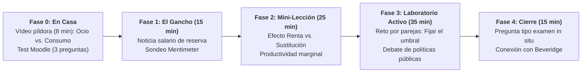

# Guion de Sesión EB 3 · Semana 2 (Lunes 21/09/2026)
## Oferta y Demanda de Trabajo, Salario de Reserva y Equilibrio
**Asignatura:** Políticas Sociolaborales y de Empleo (Código 102023)  
**Curso Académico:** 2026-2027 | Semestre 1  
**Profesor:** Manuel A. Hidalgo Pérez  
**Archivo de guion:** `guion_sesion_2109_lunes.md`

---

## ⏱️ 1. Ficha Técnica de la Sesión

| Parámetro | Línea 1 (Turno de Mañana) | Línea 2 (Turno de Tarde) |
| :--- | :--- | :--- |
| **Día y Fecha** | **Lunes, 21 de septiembre de 2026** | **Lunes, 21 de septiembre de 2026** |
| **Horario y Duración** | **13:30 – 15:00** (90 minutos / 1,5 h) | **20:00 – 21:30** (90 minutos / 1,5 h) |
| **Aula Oficial** | **Aula E13A7** (Edif. 13, Aula 7 — Mobiliario móvil) | **Aula E10A3** (Edif. 10, Aula 3) |
| **Material Base** | • [Tema 1 (Diapositivas 2627)](file:///c:/Users/Usuario/Dropbox/DOCENCIA%20UPO/CURSO%2026-27/PSLL/Temas%20EB/Tema%201/Diapositivas/Tema%201%202627.pptx) (Slides 20–35) • [Tema 1 (Apuntes)](file:///c:/Users/Usuario/Dropbox/DOCENCIA%20UPO/CURSO%2026-27/PSLL/Temas%20EB/Tema%201/Apuntes/Tema%201%202627_maquetado.docx) (Sección 3: Oferta, Demanda y Salarios) |

---

## 📋 2. Tareas Pendientes para el Profesorado (Checklist previo)

- [ ] **Seleccionar noticia disparadora sobre el dilema del Salario de Reserva:**
  - *Propuesta del asistente:* Noticia económica / laboral: *"El debate del salario de reserva: ¿por qué los jóvenes rechazan empleos a jornada partida por 1.100 € al mes cuando el alquiler medio supera los 800 €?"* (El País / El Diario).
  - *Pregunta clave asociada:* «¿Es racional rechazar un empleo cobrando menos que el salario de reserva o es un fallo moral? ¿Cómo influyen el transporte, el coste de la vivienda y las prestaciones públicas en el umbral mínimo aceptable?».
- [ ] **Configurar cuestionario interactivo de arranque en Mentimeter:**
  - *Pregunta 1:* «Si te ofrecen mañana un trabajo de 40 horas semanales por 1.200 € netos pero tardas 1h 30m en transporte diario y tienes una ayuda familiar de 500 €, ¿aceptas el empleo?» (Sí / No).
  - *Pregunta 2:* «Cuando los salarios suben mucho, ¿la gente siempre quiere trabajar más horas o llega un punto en que prefiere trabajar menos?» (Efecto sustitución vs. Efecto renta).
- [ ] **Subir al Aula Virtual el micro-caso de cálculo de elasticidades:**
  - Hoja de trabajo con las curvas de oferta y demanda laboral para proyectar en el Bloque 3.
- [ ] **Revisar el mapa de calor del cuestionario previo de Moodle:**
  - Comprobar cuántos alumnos completaron el test de la Fase 0 en casa.

---

## 🎯 3. Objetivos de Aprendizaje y Competencias Clave

1. **Modelizar la Decisión Individual de Oferta de Trabajo:** Comprender la disyuntiva entre ocio y consumo, la tensión entre el **Efecto Sustitución** (el ocio se encarece) y el **Efecto Renta** (con más dinero compro más ocio), y derivar la curva de oferta individual que se curva hacia atrás (*backward-bending*).
2. **Operativizar el Concepto de Salario de Reserva ($w_R$):** Entender que un desempleado solo acepta una oferta si $w \ge w_R$, y analizar cómo las prestaciones por desempleo, los subsidios asistenciales y los costes de desplazamiento elevan este umbral.
3. **Analizar la Demanda de Trabajo Empresarial:** Explicar por qué la demanda laboral es una demanda derivada de la productividad marginal ($P \cdot PMg_L = w$), y evaluar el impacto de costes no salariales (cotizaciones a la Seguridad Social).

---

## 🔁 4. Estructura de Aula Invertida (*Flipped Classroom*)

### Fase 0: Antes de Clase · Trabajo Autónomo del Alumnado (En Casa)
- **Recurso digital provisto:** Píldora en vídeo (8 min): *«¿Por qué trabajamos? La microeconomía de la oferta de trabajo y el salario de reserva explicada con ejemplos de la vida real»*.
- **Comprobación formativa automatizada:** Cuestionario de 3 preguntas en Moodle (autocalificable).

---

## ⏱️ 5. Desarrollo Minuto a Minuto en el Aula Presencial (90 min)

### Bloque 1: El Gancho y Sondeo del Salario de Reserva (00:00 – 00:15 · 15 min)
- **Actividad del Profesor (5 min):**
  - Proyección de testimonios reales de ofertas laborales no cubiertas frente al coste de la vida en grandes ciudades andaluzas (Sevilla/Málaga).
  - Planteamiento del concepto de **Salario de Reserva ($w_R$)**: el salario mínimo exacto por el cual un individuo está dispuesto a renunciar a su tiempo libre o a su actividad no remunerada.
- **Sondeo en Mentimeter y Dinámica de Arranque (10 min):**
  - Votación anónima: cada estudiante introduce numéricamente cuál es su salario neto mensual de reserva hoy y cuál sería si tuviera vivienda propia pagada.
  - El profesor proyecta la dispersión de resultados: demuestra visualmente cómo el entorno institucional y familiar determina la oferta de trabajo.

### Bloque 2: Mini-Lección Quirúrgica · Oferta y Demanda de Trabajo (00:15 – 00:40 · 25 min)
- **Exposición conceptual (Diapositivas 20 a 28 — Paleta menta/salvia/coral):**
  - **Lado de la Oferta (Los Trabajadores):**
    - La restricción presupuestaria: $C = w \cdot (T - L) + Y_{NS}$ (donde $Y_{NS}$ son rentas no salariales, como subsidios o rentas familiares).
    - ¿Qué pasa cuando sube el salario ($w$)?
      - *Efecto Sustitución:* Trabajar compensa más; sustituyo ocio por trabajo ($\uparrow$ horas).
      - *Efecto Renta:* Soy más rico; demando más ocio ($\downarrow$ horas).
    - ¿Qué efecto domina en rentas bajas vs. rentas muy altas?
  - **Lado de la Demanda (Las Empresas):**
    - Maximización de beneficios: la empresa contrata hasta que el valor de lo que produce el último trabajador iguala su coste total:
      $$P \cdot PMg_L = w \cdot (1 + \tau)$$
      donde $\tau$ es la tasa de cotizaciones a la Seguridad Social a cargo de la empresa.
  - **Equilibrio Agregado:** Excedente del trabajador, excedente del empresario y por qué el mercado de trabajo no se vacía como el mercado de manzanas (fricciones, rigideces salariales).

### Bloque 3: Laboratorio Activo · Misión Técnica por Parejas (00:40 – 01:15 · 35 min)
- **Reto Práctico (Rol de Analistas de Empleo):**
  - Se proyecta un caso concreto:
    > *«Un trabajador desempleado de 50 años percibe un subsidio asistencial de 480 €/mes ($Y_{NS}$). Recibe una oferta para trabajar como mozo de almacén a jornada completa por 1.150 € netos. Para acudir a la nave logística debe gastar 180 € al mes en combustible y transporte, y perdería automáticamente el subsidio de 480 €»*.
  - **Misión de la pareja (15 min):**
    1. Calcular la **ganancia neta real por hora trabajada**.
    2. Determinar la **tasa marginal implícita de tributación / pérdida de subsidio**.
    3. Explicar técnicamente por qué este trabajador puede decidir racionalmente no aceptar la oferta (la trampa de la pobreza y el salario de reserva).
    4. Proponer una reforma técnica desde el lado de las políticas sociolaborales para resolver el bloqueo (ej. compatibilidad parcial o bonificación de transporte).
- **Debriefing Socrático en Plenario (20 min):**
  - El profesor modera la discusión entre dos parejas con propuestas distintas.
  - Conexión directa: este dilema es el núcleo del **Caso 2 de EPD (Ingreso Mínimo Vital e Incentivo al Empleo)**.

### Bloque 4: Cierre Metacognitivo y Pregunta Tipo Examen (01:15 – 01:30 · 15 min)
- **Pregunta Tipo Examen (Simulacro individual de 3 minutos):**
  > *«Explique analíticamente qué efecto tendrá sobre la oferta laboral agregada y sobre el salario de reserva individual una reforma que incremente la generosidad y duración de las prestaciones asistenciales por desempleo. Represente gráficamente el desplazamiento de la curva de oferta en el plano Salario Real - Empleo».*
- **Rúbrica de corrección proyectada:**
  - $\uparrow$ Salario de reserva individual ($w_R$).
  - Desplazamiento hacia la izquierda de la curva de oferta agregada ($L^S$).
  - Reducción del empleo de equilibrio y aumento de la presión salarial al alza.
- **Enlace transmedia con la Sesión 4:**
  - *«El martes/viernes conectaremos la oferta y la demanda con las vacantes reales. Descubriremos la función de emparejamiento de Pissarides y la Curva de Beveridge, la herramienta definitiva para arrancar el Caso 1 de EPD»*.

---

## 📎 6. Material y Fuentes Propuestas para la Sesión

1. **Lectura breve recomendada:**
   - Bentolila, S. y Jansen, M. (Blog *Nada es Gratis*): *«El salario de reserva y los desincentivos al trabajo en el sistema asistencial español»*.
2. **Material gráfico:**
   - Diapositivas 20 a 35 del deck oficial de la asignatura.
3. **Evaluación formativa del docente:**
   - Registro in situ del rigor en el cálculo de la ganancia neta en el reto por parejas.
