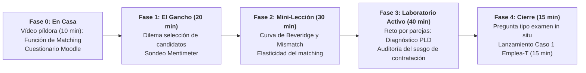

# Guion de Sesión EB 4 · Semana 2 (Martes 22/09 / Viernes 25/09)
## Matching de Pissarides, Paro de Larga Duración y la Curva de Beveridge
**Asignatura:** Políticas Sociolaborales y de Empleo (Código 102023)  
**Curso Académico:** 2026-2027 | Semestre 1  
**Profesor:** Manuel A. Hidalgo Pérez  
**Archivo de guion:** `guion_sesion_2109_martes.md`

---

## ⏱️ 1. Ficha Técnica de la Sesión

| Parámetro | Línea 1 (Turno de Mañana) | Línea 2 (Turno de Tarde) |
| :--- | :--- | :--- |
| **Día y Fecha** | **Martes, 22 de septiembre de 2026** | **Viernes, 25 de septiembre de 2026** |
| **Horario y Duración** | **09:30 – 11:30** (**120 minutos / 2,0 h**) | **17:30 – 19:30** (**120 minutos / 2,0 h**) |
| **Aula Oficial** | **Aula E13A7** (Edif. 13, Aula 7 — Mobiliario móvil) | **Aula E10A3** (Edif. 10, Aula 3) |
| **Material Base** | • [Tema 1 (Diapositivas 2627)](file:///c:/Users/Usuario/Dropbox/DOCENCIA%20UPO/CURSO%2026-27/PSLL/Temas%20EB/Tema%201/Diapositivas/Tema%201%202627.pptx) (Slides 36–60) • [Tema 1 (Apuntes)](file:///c:/Users/Usuario/Dropbox/DOCENCIA%20UPO/CURSO%2026-27/PSLL/Temas%20EB/Tema%201/Apuntes/Tema%201%202627.docx) (Sección 4: Curva de Beveridge y Matching) |

> **Nota de coordinación:** Este guion aplica de forma idéntica en contenido, dinámicas y duración (120 min) al grupo de mañana (martes 22/09) y al grupo de tarde (viernes 25/09).

---

## 📋 2. Tareas Pendientes para el Profesorado (Checklist previo)

- [ ] **Seleccionar noticia disparadora sobre Parados de Larga Duración (PLD):**
  - *Propuesta del asistente:* Informe del mercado laboral / Datos EPA: *"El núcleo duro del desempleo en Andalucía: el 44% de los parados lleva más de un año buscando trabajo y los mayores de 45 años sufren una tasa de salida del desempleo inferior al 5% trimestral"* (Diario de Sevilla / INE).
  - *Pregunta clave asociada:* «¿Por qué una empresa prefiere contratar a un desempleado reciente antes que a un parado de larga duración con idéntica titulación académica? ¿Es depreciación real de habilidades o es estigma/discriminación estadística?».
- [ ] **Configurar cuestionario interactivo en Mentimeter:**
  - *Pregunta:* «Te ponen sobre la mesa dos currículums idénticos: Candidato A lleva 1 mes en paro; Candidato B lleva 2 años en paro. Como director de RRHH, ¿a quién llamas primero para la entrevista?» (Candidato A / Candidato B / Indiferente).
- [ ] **Preparar en el Aula Virtual la Orden del Programa Emplea-T:**
  - Disponer del enlace al PDF de la Orden de 3 de octubre de 2024 de la Junta de Andalucía para proyectarlo en el cierre como puente al Caso 1 de EPD.
- [ ] **Revisar el mapa de calor del cuestionario previo de Moodle:**
  - Identificar si hay dudas sobre el concepto de tensión del mercado laboral ($\theta = V/U$).

---

## 🎯 3. Objetivos de Aprendizaje y Competencias Clave

1. **Formalizar la Función de Emparejamiento (*Matching Function*):** Entender la tecnología que casa vacantes ($V$) y desempleados ($U$) inspirada en el modelo Nobel de Diamond-Mortensen-Pissarides:
   $$M = A \cdot U^\alpha \cdot V^{1-\alpha}$$
   y analizar el papel crucial del parámetro de eficiencia institucional ($A$).
2. **Diagnosticar el Desajuste Laboral (*Mismatch*):** Diferenciar entre desajuste educativo/formativo (*skills mismatch*) y desajuste espacial/geográfico (*spatial mismatch*), y entender cómo ambos desplazan la Curva de Beveridge hacia afuera.
3. **Comprender la Mecánica del Paro de Larga Duración:** Analizar los tres mecanismos que atrapan a los desempleados estructurales: histéresis, depreciación de capital humano y señalización adversa / estigma del empleador.
4. **Preparar el Instrumental Técnico del Caso 1 de EPD:** Sentar las bases teóricas de los incentivos a la contratación que se diseñarán en las prácticas.

---

## 🔁 4. Estructura de Aula Invertida (*Flipped Classroom*)

### Fase 0: Antes de Clase · Trabajo Autónomo del Alumnado (En Casa)
- **Recurso digital provisto:** Píldora en vídeo (10 min): *«La función de matching y la tensión del mercado: cómo se encuentran empresas y trabajadores según Mortensen y Pissarides»*.
- **Comprobación formativa automatizada:** Cuestionario de 3 preguntas de comprobación en el campus virtual.

---

## ⏱️ 5. Desarrollo Minuto a Minuto en el Aula Presencial (120 min)

### Bloque 1: El Gancho y el Enigma del Paro Prolongado (00:00 – 00:20 · 20 min)
- **Actividad del Profesor (8 min):**
  - Proyección de la noticia disparadora sobre el paro de larga duración en Andalucía y la brecha de empleabilidad en mayores de 45 años.
  - Presentación del dilema de la selección de personal: el coste de buscar información sobre candidatos desconocidos.
- **Dinámica en Mentimeter y Debate Relámpago (12 min):**
  - Los alumnos votan anónimamente a qué candidato contratarían (A: 1 mes en paro vs. B: 2 años en paro).
  - Más del 85% de la clase suele elegir al Candidato A.
  - *Pregunta socrática del docente:* «¿Por qué habéis discriminado al Candidato B si tiene exactamente el mismo título universitario y las mismas notas que el Candidato A?».
  - Introducción de los conceptos de **asimetría de información** y **señalización estadística**.

### Bloque 2: Mini-Lección Quirúrgica · Matching y Curva de Beveridge (00:20 – 00:50 · 30 min)
- **Exposición conceptual (Diapositivas 36 a 48 — Paleta menta/salvia/coral):**
  - **La Función de Emparejamiento:**
    $$M = m(U, V) = A \cdot U^\alpha \cdot V^{1-\alpha}$$
  - **Tensión del mercado ($\theta = V/U$):**
    - Si $\theta$ es alta: muchas vacantes por parado $\rightarrow$ mercado tensionado (fácil encontrar empleo, difícil para la empresa contratar).
    - Si $\theta$ es baja: pocos puestos y muchos parados $\rightarrow$ mercado deprimido.
  - **La probabilidad de salida del paro ($f$):**
    $$f(\theta) = \frac{M}{U} = A \cdot \theta^{1-\alpha}$$
  - **El parámetro de eficiencia $A$:**
    - ¿Qué hace subir $A$? Buenas plataformas de empleo, servicios de orientación eficientes, movilidad geográfica.
    - ¿Qué hace caer $A$? Desajuste formativo masivo y parados de larga duración cuyos conocimientos quedan obsoletos.
  - **La Curva de Beveridge en España (1980–2024):**
    - El gran desplazamiento hacia la derecha tras la crisis de 2008: España necesitó muchas más vacantes para lograr el mismo nivel de paro debido a la bolsa de parados de larga duración de la construcción.

### Bloque 3: Laboratorio Activo · Misión de Diagnóstico Técnico por Parejas (00:50 – 01:30 · 40 min)
- **Misión de Trabajo (Rol de Técnicos de la Consejería de Empleo):**
  - Se distribuye a cada pareja una ficha con datos desglosados de paro registrado en Andalucía:
    - 45% parados de larga duración (>12 meses).
    - 60% de los PLD son mayores de 45 años o mujeres con baja cualificación formal.
  - **Reto Práctico (20 min):**
    1. Identificar si el fallo principal es un **desajuste formativo** (*skills mismatch*) o un **estigma puro de contratación**.
    2. Modelizar en la función de matching qué ocurre si las empresas ignoran sistemáticamente al 45% de los desempleados (reducción del desempleo efectivo relevante).
    3. Diseñar **dos requisitos técnicos** que debería tener una subvención pública a la contratación para romper este bloqueo sin provocar que la empresa despida a un trabajador actual para cobrar la ayuda (anticipar la cláusula de empleo neto).
- **Puesta en común socrática (20 min):**
  - Dos parejas exponen su propuesta ante el plenario.
  - El profesor actúa como "Director General de Políticas de Empleo", rebatiendo las propuestas débiles y premiando las argumentaciones basadas en incentivos y costes de búsqueda.

### Bloque 4: Cierre Metacognitivo y Pregunta Tipo Examen (01:30 – 01:45 · 15 min)
- **Pregunta Tipo Examen (Resolución individual de 3 minutos):**
  > *«Considere una economía donde el número de vacantes ($V$) se duplica, pero la tasa de salida del desempleo ($f$) permanece inalterada para los desempleados de más de un año. Utilizando la función de emparejamiento $M = A \cdot U^\alpha \cdot V^{1-\alpha}$ y la Curva de Beveridge:*  
  > *a) Explique qué ha ocurrido con el parámetro de eficiencia $A$ para este colectivo.*  
  > *b) Represente gráficamente el efecto sobre la Curva de Beveridge.*  
  > *c) Razone por qué una bonificación a la contratación generalista puede no solucionar este problema si no se acompaña de formación específica».*
- **Rúbrica proyectada:**
  - Deducción de la caída en la eficiencia de matching ($A$).
  - Gráfico con desplazamiento hacia afuera de la curva.
  - Justificación de la pérdida de capital humano y complementariedad con formación.

### Bloque 5: Despliegue Transmedia y Puente hacia el Caso 1 de EPD (01:45 – 02:00 · 15 min)
- **Lanzamiento del Caso 1 en Aula Virtual:**
  - Proyección de la portada de la **Orden de 3 de octubre de 2024 (Programa Emplea-T de la Junta de Andalucía)**.
  - Anuncio: *«En las sesiones de EPD que arrancan en la Semana 5, vuestro equipo asumirá la auditoría y rediseño de esta orden real. Todo lo que hemos visto hoy sobre Beveridge y emparejamiento será vuestra principal herramienta de trabajo»*.
- **Instrucción para los estudiantes:** Descargar la orden de la plataforma y conformar los equipos de trabajo antes de la próxima semana.

---

## 📎 6. Material y Fuentes Propuestas para la Sesión

1. **Documento normativo real:**
   - Junta de Andalucía: *Orden de 3 de octubre de 2024, por la que se aprueban las bases reguladoras para la concesión de subvenciones del Programa Emplea-T*.
2. **Lectura doctrinal:**
   - Mortensen, D. y Pissarides, C. (Premio Nobel 2010): *«Job Creation and Job Destruction in the Theory of Unemployment»* (extracto en el repositorio docente).
3. **Evaluación formativa del docente:**
   - Rúbrica in situ para evaluar la capacidad de transferir la teoría de matching al problema empírico de los parados de larga duración.
