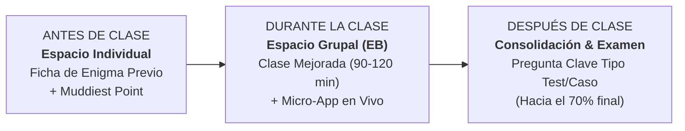

# Plan de Innovación Docente y Dinamización de Sesiones EB
## Asignatura: Políticas Sociolaborales y de Empleo (PSLL) — Curso 2026-27
**Profesor responsable:** Manuel A. Hidalgo Pérez  
**Facultad de Derecho — Universidad Pablo de Olavide (UPO)**  
**Marco de referencia:** Cuaderno NotebookLM *«Estrategias y Dinámicas para un Aprendizaje Significativo y Práctico»* (ID: `b94a743f-30fe-4b04-b7b4-d4da08e06d16`)

---

## 1. Diagnóstico y Objetivos de la Propuesta

### 1.1 El Punto de Partida
- **Estructura oficial (Modelo A1):** 31 horas de Enseñanzas Básicas (EB — gran grupo) y 14 horas de Enseñanzas Prácticas y de Desarrollo (EPD — grupos reducidos).
- **Sistema de evaluación oficial:** 70% prueba de evaluación final (EB) y 30% evaluación continua (EPD).
- **El reto en las EB:** Dado que la asistencia a las sesiones teóricas (EB) no es legalmente obligatoria por reglamento universitario y que todo el material de lectura (`.docx` y `.pdf`) está disponible en el Aula Virtual, el modelo tradicional de "clase magistral expositiva" favorece el absentismo o la desconexión cognitiva pasiva en el aula.
- **El impacto de la Inteligencia Artificial:** Pedir trabajos extensos o lecturas pasivas para realizar en casa es ineficaz; los modelos de lenguaje (LLM) resuelven estas tareas en segundos. El aprendizaje, la reflexión y la evaluación formativa deben suceder **de manera sincrónica y vivencial en el aula presencial**.

### 1.2 Objetivos Estratégicos
1. **Crear la "Necesidad de Asistir":** Que el estudiante perciba que acudir a clase le ahorra horas de estudio individual y le otorga ventajas directas y tangibles de cara al examen y a la evaluación continua.
2. **Curación Inteligente del Temario:** No leer ni recitar en clase lo que el estudiante ya tiene redactado en los apuntes; reservar el tiempo cara a cara para la discusión de dilemas, mecanismos causales y paradojas empíricas.
3. **Maximizar el Aprendizaje Autónomo:** Activar la lectura previa mediante retos de microaprendizaje (*Fichas de Enigma Previo*) de baja fricción que motiven la consulta de los apuntes antes de entrar al aula.
4. **Gamificación Interactiva con Micro-Apps *ad hoc*:** Introducir dinámicas de simulación y toma de decisiones en tiempo real a través de aplicaciones web ligeras (ejecutables desde el teléfono móvil mediante código QR).

---

## 2. El Ciclo de Aprendizaje: La Triada "Antes – Durante – Después"

El cuaderno pedagógico propone el modelo del **Ecosistema de Aprendizaje Profundo**, articulado en tres fases interconectadas:

### Fase 1: Antes de Clase (Espacio Individual de Trabajo Autónomo)
- **La Ficha de Enigma Previo (1 página):** No se pide al alumno que "se estudie el tema". Se publica una ficha breve con **1 o 2 paradojas reales del mercado laboral** que solo pueden entenderse consultando determinados epígrafes del documento de apuntes.
- **El "Punto más Confuso" (*Muddiest Point*):** Un buzón digital de una sola línea en el Aula Virtual donde los alumnos indican anónimamente qué concepto de la lectura les ha parecido más contraintuitivo o difícil. El docente utiliza estas respuestas para calibrar el arranque de la clase.

### Fase 2: Durante la Clase (Espacio Grupal de Interacción en el Aula)
- La sesión presencial no compite con el texto: **resuelve el misterio y experimenta las decisiones**.
- Aplicación del formato de la **"Clase Mejorada" (*Enhanced Lecture*)**: bloques expositivos de máximo 20 minutos intercalados con actividades activas de discusión en parejas (*Think-Pair-Share*) y simulaciones con micro-apps.

### Fase 3: Después de Clase (Conexión con el Examen Oficial)
- En los últimos minutos de cada sesión se trabaja **un reto o pregunta análoga a la prueba final de la asignatura**.
- El estudiante experimenta que la sesión presencial le prepara directamente para superar el 70% de la calificación oficial.

---

## 3. Estructura Tipo de una Sesión EB (90 a 120 minutos)

A partir del modelo pedagógico de pausas activas y dinamización de grandes grupos, cada sesión de EB se estructurará en 5 bloques cronometrados:

| Bloque | Minutos | Actividad del Profesor | Actividad de los Estudiantes |
| :--- | :---: | :--- | :--- |
| **1. El Gancho y el *Muddiest Point*** | 10–15 min | Presenta la paradoja del día y las dudas más frecuentes enviadas por el buzón virtual. | Votan su intuición inicial o comentan en parejas durante 2 minutos (*Think-Pair-Share*). |
| **2. Mini-Lección Magistral 1 (Núcleo Causal)** | 25 min | Exposición rigurosa de los mecanismos económicos e institucionales centrales (apoyada en diapositivas de marca). | Toman notas centradas en relaciones de causalidad y *trade-offs*. |
| **3. Simulación en Vivo con Micro-App *ad hoc*** | 30 min | Lanza el enlace/QR de la micro-app. Plantea el escenario de política sociolaboral a resolver. | En parejas, toman decisiones en la aplicación desde el móvil/portátil y ven el impacto en tiempo real. |
| **4. Mini-Lección 2 + *Debriefing*** | 20–25 min | Proyecta los resultados globales de la clase. Utiliza los aciertos y errores de los alumnos para explicar la teoría empírica. | Contrastan sus hipótesis iniciales con los modelos económicos de la literatura. |
| **5. Cierre: Pregunta Tipo Examen** | 10–15 min | Plantea una pregunta real de examen sobre el caso analizado y explica los criterios de rigor que se evaluarán. | Ensayan mentalmente o por escrito la respuesta y consolidan el aprendizaje. |

---

## 4. Criterio de Curación de Contenidos: ¿Qué se explica y qué no?

Para no saturar las sesiones presenciales, se aplicará el siguiente filtro curricular a cada uno de los temas:

### 🛑 Se queda en el documento de apuntes (Lectura autónoma):
- Catálogos exhaustivos de artículos legales o trámites administrativos (ej. listados de tipos contractuales, requisitos burocráticos del SEPE).
- Tablas estadísticas extensas o series históricas de contexto.
- Fórmulas algebraicas o definiciones puramente nemotécnicas (ej. cálculo aritmético de tasas de actividad/paro).

### 🎯 Se explica y debate en el aula presencial (Conceptos Nucleares):
- **Mecanismos de incentivos y conducta:** Cómo reaccionan trabajadores y empleadores ante un cambio normativo o institucional.
- **Dilemas y *Trade-offs* de política económica:** Eficiencia vs. Equidad, Protección del *insider* vs. Oportunidades del *outsider*, Efecto desincentivo vs. Efecto liquidez.
- **Falacias del sentido común:** Desmontar mitos populares (ej. la falacia de la cantidad fija de trabajo, la neutralidad del coste de despido).

---

## 5. Catálogo de Micro-Apps Interactivas por Temas

Las micro-apps serán herramientas web ligeras (HTML5/CSS/JavaScript), responsive para smartphone y sin requerimiento de registro ni servidor externo:

| Tema | Nombre de la Micro-App | Dinámica en el Aula |
| :--- | :--- | :--- |
| **Tema 1: Mercado de trabajo y flujos** | *Simulador de Flujos y Curva de Beveridge* | Los alumnos ajustan flujos de entrada/salida y choque migratorio para comprobar por qué el desempleo y las vacantes pueden convivir. |
| **Tema 2: Políticas Activas de Empleo (PAE)** | *El Gestor de Fondos del SEPE* | Distribución de un presupuesto limitado entre formación, bonificaciones y orientación, midiendo efectos de peso muerto y sustitución. |
| **Tema 3: Políticas Pasivas y Desempleo** | *La Trampa de la Pobreza y Salario de Reserva* | Simular la decisión de un trabajador ante distintas tasas de reemplazo y complementos salariales (reforma asistencial de 2024). |
| **Tema 4: Dualidad y Costes de Despido (EPL)** | *El Simulador de Contratación Dual* | Una empresa ante un ciclo económico: qué contratos se rescinden primero y cómo influyen las indemnizaciones en la rotación laboral. |
| **Tema 5: Negociación Colectiva** | *El Tablero de la Negociación Salarial* | Juego de roles interactivo (Patronal vs. Sindicato) con asimetría de información y convenios colectivos. |
| **Tema 6: Salarios y Desigualdad** | *El Dilema del Salario Mínimo (SMI)* | Medir elasticidades de empleo en sectores de bajo valor añadido frente a ganancias agregadas de renta. |
| **Tema 7: Pensiones y Reto Demográfico** | *La Balanza Intergeneracional 2050* | Simular la tasa de dependencia demográfica y ajustar edad de jubilación, cotizaciones y factor de sostenibilidad. |

---

## 6. Próximos Pasos de Implementación
1. **Validación del modelo:** Revisión y ajuste conjunto de esta propuesta.
2. **Prototipo Piloto (Tema 1):**
   - Redacción de la *Ficha de Enigma Previo del Tema 1*.
   - Programación de la primera micro-app interactiva del Tema 1.
   - Ajuste de las diapositivas esenciales para la sesión EB.
3. **Escalado progresivo:** Aplicación secuencial al resto de temas del curso 2026-27.
