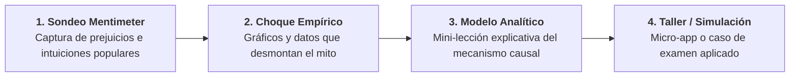
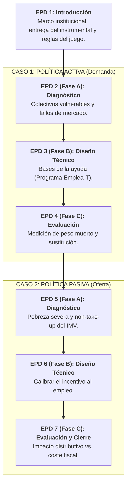

# Plan de Innovación Docente: Sincronización EB y EPD
## Políticas Sociolaborales y de Empleo (PSLL) · Curso 2026-27
**Profesor responsable:** Manuel A. Hidalgo Pérez · Universidad Pablo de Olavide (UPO)

---

## 1. Principio Rector: Del Concepto al Taller Aplicado

* **Modelo A1:** 31 h de Enseñanzas Básicas (EB · gran grupo) + 14 h de Prácticas (EPD · grupos reducidos de ~20 alumnos en aula de informática).
* **Evaluación:** 70% prueba final (EB) y 30% evaluación continua (EPD con asistencia obligatoria).
* **Conexión EB $\rightarrow$ EPD:** Las EB no preparan una práctica puntual a la semana siguiente. Durante las primeras semanas (Temas 1 y 2), la EB construye el **bagaje conceptual acumulado** (flujos, PIB/VAB, salarios, productividad, tipos de paro, matching y políticas activas). En la EPD, el alumno aplica ese instrumental para evaluar y parametrizar políticas reales.

---

## 2. Metodología de las Enseñanzas Básicas (EB): El Ciclo del Choque Cognitivo

Para activar la participación y superar la pasividad del gran grupo, **cada sesión de EB sigue un ciclo estructurado en 4 fases**:

1. **Apertura con Mentimeter (Pre-test de prejuicios):** Cada sesión arranca con una pregunta detonante donde los alumnos votan con su móvil antes de ver ningún dato ni teoría. El objetivo es aflorar las intuiciones espontáneas del sentido común (p. ej. *«subir salarios un 15% por ley para converger con Alemania»*, *«la automatización destruye empleo neto»*, etc.).
2. **Choque de realidad con datos empíricos:** Inmediatamente tras proyectar los resultados del sondeo, el profesor proyecta las figuras y series reales (EPA, Eurostat, OCDE) que desmienten empíricamente el prejuicio mayoritario.
3. **Formalización teórica:** Con el alumno descolocado y receptivo, se presenta el modelo económico que explica la realidad (VAB, deflactor, modelo de Coste Laboral Unitario).
4. **Cierre con Reto Manuscrito y Subida Fotográfica (10 min):**
   * **Diseño de las preguntas:** Las preguntas del reto final están **100% basadas en lo explicado en clase ese día y en el material previo** disponible en el aula virtual. No buscan memorismo abstracto, sino **demostrar atención y seguimiento activo en el aula**. El docente conoce la pregunta de antemano para asegurar que ese mecanismo causal se enfatiza explícitamente en la lección.
   * **Mecánica analógica-digital:** El alumno redacta la respuesta **a mano en papel (10 min)** sin dispositivos. Al terminar el tiempo, se proyecta el **código QR de Microsoft Forms (con cuenta UPO)** para subir una foto nítida de la hoja manuscrita (2 min).
   * **Incentivo y Gamificación:** Las entregas correctas acumulan puntos de seguimiento que desbloquean **beneficios tangibles para el examen final (70%)** (p. ej., el comodín de descarte de preguntas o bonificación de nota), erradicando el absentismo y la pasividad.
   * **Corrección asistida por IA:** Las fotos sincronizadas en OneDrive se transcriben y corrigen con modelos de visión aplicando la rúbrica oficial, generando el cuadro de puntos para el campus virtual.

---

## 3. Las EPD: 7 Sesiones en Aula de Informática (Contexto Controlado)

Las prácticas se desarrollan en **aula de informática con ordenadores individuales o por parejas**, en un entorno estructurado y pragmático:

### Arquitectura de los Dos Casos (3 sesiones por caso)

### Dinámica Pragmática en el Aula (Workflow de 90 min)
Para evitar clases aburridas con alumnos pasivos, la sesión se pauta paso a paso frente a la pantalla:

1. **Pauta inicial del profesor (15 min):** Presentación del reto técnico del día sobre la norma o datos oficiales (BOJA, FSE+, informes AIReF).
2. **Trabajo guiado en terminal (50 min):**
   * Cada alumno/pareja trabaja en su ordenador con una plantilla estructurada.
   * Realizan tareas concretas: localización y análisis de artículos de la norma, cálculo de costes e incentivos reales, y respuesta a preguntas de juicio técnico basadas en los conceptos de las EB.
3. **Puesta en común y entrega in situ (25 min):** Se comentan soluciones en pantalla y **se sube obligatoriamente la ficha de trabajo al campus virtual antes de salir del aula**.

### Blindaje Anti-IA Natural
* **Sin tareas para casa:** El trabajo se inicia, se resuelve y se entrega dentro del aula de informática durante los 90 minutos de clase.
* **Supervisión directa:** El profesor acompaña y resuelve dudas en sala; no hay espacio para delegar la redacción en un LLM.
* **Evaluación Continua (30%):** La nota resulta de las entregas síncronas de las sesiones, conformando el expediente práctico del estudiante.
