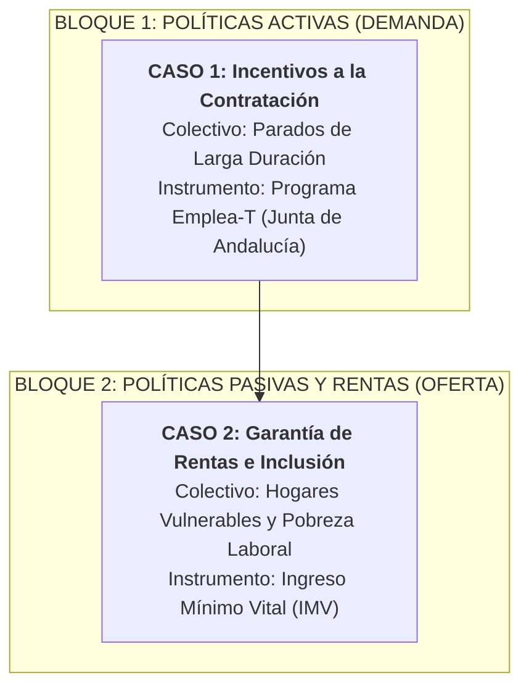
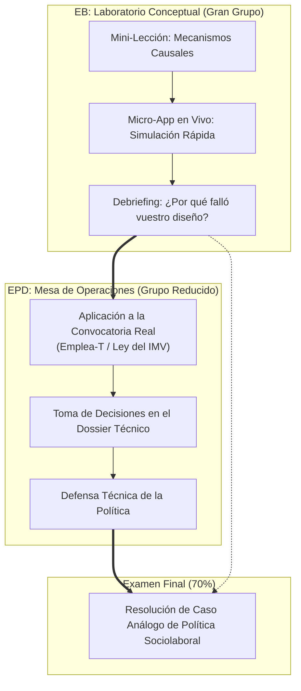

# Plan de Innovación Docente y Sincronización EB-EPD
## Asignatura: Políticas Sociolaborales y de Empleo (PSLL) — Curso 2026-27
**Profesor responsable:** Manuel A. Hidalgo Pérez  
**Facultad de Derecho — Universidad Pablo de Olavide (UPO)**  
**Marco pedagógico:** Cuaderno NotebookLM *«Estrategias y Dinámicas para un Aprendizaje Significativo y Práctico»* (ID: `b94a743f-30fe-4b04-b7b4-d4da08e06d16`)

---

## 1. Diagnóstico y Principio Rector: La Conexión Indisoluble EB ↔ EPD

### 1.1 El Punto de Partida
- **Estructura oficial del Modelo A1:** 31 horas de Enseñanzas Básicas (EB — gran grupo) y 14 horas de Enseñanzas Prácticas y de Desarrollo (EPD — grupos reducidos).
- **Sistema de evaluación oficial:** 70% prueba de evaluación final (EB) y 30% evaluación continua (EPD con asistencia obligatoria).
- **El problema tradicional:** La fractura habitual en la universidad entre teoría y práctica. Si la EB se limita a una clase magistral abstracta y la EPD se convierte en una resolución de casos desconectada, el alumno no encuentra sentido a acudir a las EB y sufre para aplicar los conceptos en las EPD.
- **El reto de la Inteligencia Artificial:** Cualquier trabajo individual o resumen para casa será resuelto por un LLM en segundos. La reflexión, el aprendizaje profundo y el desarrollo de competencias deben suceder **de manera sincrónica y vivencial en el aula (tanto en EB como en EPD)**.

### 1.2 El Principio Rector de la Asignatura
> **«La sesión de EB es el laboratorio conceptual y la caja de herramientas; la sesión de EPD es la mesa de operaciones real».**
>
> La EB no enseña teoría por erudición: proporciona exactamente los modelos analíticos, los mecanismos causales y la intuición empírica que el estudiante necesita **para tomar decisiones en su rol técnico en la EPD y para responder a la pregunta de caso del examen final (el 70%)**.

---

## 2. La Arquitectura de las EPD: El Eje Conductor del Semestre

Las prácticas (EPD) se articulan en **7 sesiones de 1,5 horas** estructuradas en torno al análisis, diseño y evaluación de las dos grandes patas del estado de bienestar laboral: **las Políticas Activas (lado de la demanda) y las Políticas Pasivas / Garantía de Rentas (lado de la oferta)**.

- **Rol del estudiante:** Técnico/a del departamento de análisis y diseño de políticas públicas (Consejería de Empleo / Ministerio de Inclusión y Seguridad Social).
- **Objetivo profesional:** Diseñar y evaluar instrumentos reales con datos empíricos de primer nivel (evaluaciones de la AIReF, órdenes de la Junta de Andalucía y microdatos de la EPA).
- **Entregable transversal:** Un **Dossier de Política acumulativo** que crece práctica a práctica y constituye el núcleo de la evaluación continua (30%).

### Los Dos Casos de Estudio en EPD (3 sesiones por caso):

| Sesión EPD | Bloque | Foco de la Sesión en EPD | Conexión con los Contenidos de EB |
| :---: | :--- | :--- | :--- |
| **EPD 1** | **Introducción** | Marco institucional, rol técnico, reglas del juego y entrega del instrumental gráfico. | Conexión con Tema 1 (Marco institucional y flujos). |
| **EPD 2** | **Caso 1 · Incentivos a la Contratación (Fase A)** | **Diagnóstico:** Fallo de mercado en desempleados de larga duración (estigma, histéresis y depreciación de habilidades). | **EB Temas 1 y 2:** Curva de Beveridge, modelo de emparejamiento (*matching* de Mortensen-Pissarides) y costes de búsqueda. |
| **EPD 3** | **Caso 1 · Incentivos a la Contratación (Fase B)** | **Diseño técnico:** Definición de la convocatoria (cuantías, requisitos empresariales, condicionalidad y temporalidad tipo Orden Emplea-T). | **EB Tema 2:** Políticas Activas (PAE), tipología de subvenciones y evaluación según Card-Kluve-Weber. |
| **EPD 4** | **Caso 1 · Incentivos a la Contratación (Fase C)** | **Consecuencias y Defensa:** Medir efectos de peso muerto (*deadweight*), sustitución y sostenibilidad presupuestaria. | **EB Temas 2 y 4:** Dualidad contractual, estabilidad en el empleo y *trade-offs* de eficiencia. |
| **EPD 5** | **Caso 2 · Ingreso Mínimo Vital (Fase A)** | **Diagnóstico y el Enigma del *Non-Take-Up*:** Medición de la pobreza severa y el porqué del 50-60% de no acceso (burocracia, estigma, brecha digital). | **EB Tema 3:** Políticas Pasivas, la balanza de la protección, efectos de seguro vs. riesgo moral (*moral hazard* de Chetty). |
| **EPD 6** | **Caso 2 · Ingreso Mínimo Vital (Fase B)** | **Diseño del Incentivo al Empleo:** Calibrar la compatibilidad entre el IMV y los ingresos laborales (evitar la tasa marginal implícita del 100%). | **EB Temas 3 y 6:** La trampa de la pobreza, el salario de reserva, complementos salariales (*in-work benefits*) y salario mínimo (SMI). |
| **EPD 7** | **Caso 2 · Ingreso Mínimo Vital (Fase C)** | **Evaluación y Cierre del Dossier:** Análisis de impacto distributivo vs. coste fiscal según los informes de la AIReF. Defensa final. | **EB Tema 6 y 7:** Eficiencia vs. Equidad, sostenibilidad del gasto público y ensayo del caso del examen final. |

---

## 3. La Función de las Sesiones EB: Entrenar el Caso Práctico

Para que las EB tengan sentido y creen una necesidad imperiosa de asistencia, **cada bloque de EB se diseña como el entrenamiento analítico previo de la siguiente sesión de EPD**:

### ¿Por qué el alumno no puede permitirse faltar a la EB?
1. **Asistir a la EB te aprueba la EPD:** En la EB se desmenuzan con la **micro-app** exactamente las mismas variables y dilemas que el alumno tendrá que plasmar en el Dossier de la EPD:
   - En el Caso 1: simulan cómo una ayuda mal calibrada provoca despidos de trabajadores fijos (efecto sustitución).
   - En el Caso 2: simulan cómo quitar 1 € de IMV por cada 1 € ganado en el trabajo empuja al perceptor a rechazar empleos formales o sumergirse en la economía sumergida (trampa de la pobreza).
2. **Asistir a la EB te aprueba el 70% del Examen Final:** El examen final exigirá argumentar como un evaluador de políticas públicas. La EB entrena semanalmente este razonamiento crítico.

---

## 4. Estructura Tipo de una Sesión EB (90 a 120 minutos)

Siguiendo el modelo de la **"Clase Mejorada" (*Enhanced Lecture*)** del cuaderno NotebookLM:

| Bloque | Minutos | Actividad del Profesor | Actividad de los Alumnos |
| :--- | :---: | :--- | :--- |
| **1. El Gancho y el Enigma Previo** | 10–15 min | Lanza el dilema del día (ej. *«Si el IMV busca sacar de la pobreza, ¿por qué la mitad de las familias con derecho a cobrarlo no lo piden?»*). | Votan su intuición inicial o debaten en parejas durante 2 minutos (*Think-Pair-Share*). |
| **2. Mini-Lección 1: Mecanismo Causal** | 25 min | Exposición teórica quirúrgica del mecanismo económico (tasa marginal efectiva, salario de reserva, matching). Máximo 6 diapositivas con la paleta de marca. | Toman notas focalizadas en la relación causa-efecto que necesitarán en su dossier. |
| **3. Micro-App Interactiva en Vivo** | 30 min | Proyecta el código QR de la micro-app del tema. Plantea el reto de simulación: *«Tenéis 15 minutos para calibrar el incentivo al empleo del IMV sin disparar el déficit»*. | En parejas, ajustan parámetros desde el móvil o portátil y visualizan los efectos en tiempo real. |
| **4. Debriefing Socrático: El Enlace con la EPD** | 20–25 min | Proyecta los resultados globales de la clase. Conecta los fallos cometidos en la app con los hallazgos de los informes reales de la AIReF. | Descubren cómo justificar técnica y económicamente su diseño para la EPD. |
| **5. Cierre: Pregunta Tipo Examen** | 10–15 min | Proyecta una pregunta real de examen sobre el caso analizado y detalla la rúbrica de corrección. | Ensayan individualmente la respuesta durante 3 minutos. |

---

## 5. El Catálogo de Micro-Apps Alineadas con las EPD

Las micro-apps interactivas en HTML/JS son **entrenadores directos para los dos casos de la asignatura**:

| Tema EB | Micro-App *ad hoc* | Conexión Directa con EPD |
| :--- | :--- | :--- |
| **Tema 1 (Mercado de trabajo)** | *Simulador de Flujos y Curva de Beveridge* | Diagnosticar por qué los parados de larga duración quedan desconectados de las vacantes (**Fase A del Caso 1**). |
| **Tema 2 (Políticas Activas)** | *Calibrador de Subvenciones a la Contratación* | Ajustar cuantías y compromisos de permanencia para medir el peso muerto y el efecto sustitución (**Fases B y C del Caso 1**). |
| **Tema 3 (Políticas Pasivas)** | *El Simulador de la Balanza de la Protección* | Analizar el *trade-off* entre suavizamiento del consumo (efecto liquidez) y desincentivo a la búsqueda (riesgo moral de Chetty) (**Fase A del Caso 2**). |
| **Tema 3 (Garantía de Rentas)** | *El Optimizador del Incentivo al Empleo (IMV)* | Diseñar la curva de retirada gradual de la ayuda al aumentar los ingresos laborales (trampa de la inactividad) (**Fase B del Caso 2**). |
| **Tema 4 (Flexibilidad y Dualidad)** | *Simulador de Costes de Despido (EPL)* | Experimentar cómo la dualidad contractual afecta a los colectivos de baja empleabilidad (**Evaluación transversal de ambos casos**). |
| **Tema 6 (Salarios y Desigualdad)** | *Simulador de Pobreza Laboral y SMI* | Evaluar cómo interactúa el Salario Mínimo con el IMV y las rentas mínimas autonómicas (**Fase C del Caso 2**). |
| **Tema 7 (Pensiones y Sostenibilidad)** | *La Balanza Intergeneracional 2050* | Conectar el gasto en protección social y pensiones con el espacio fiscal para políticas activas e IMV (**Examen Final**). |

---

## 6. Autonomía Guiada contra la IA: La Ficha de Enigma Previo

Para activar el aprendizaje autónomo sin exigir lecturas que un LLM resumiría de forma estéril:
- **Formato:** 1 página en PDF en el Aula Virtual antes de cada bloque.
- **Contenido:** Contiene **un dato real paradójico o un gráfico oficial de la AIReF / INE** y **2 preguntas de juicio técnico**:
  - *«Revisa el gráfico de la página 14 de los apuntes sobre la tasa de cobertura del IMV. ¿Por qué el 57% de los potenciales beneficiarios no lo percibe? Identifica en el epígrafe 3.4 las 3 barreras de acceso para defender tu diagnóstico en la sesión del jueves»*.
- **Efecto:** El alumno consulta los apuntes de forma selectiva con un propósito analítico claro, llegando a la EB con las ideas listas para la simulación.
