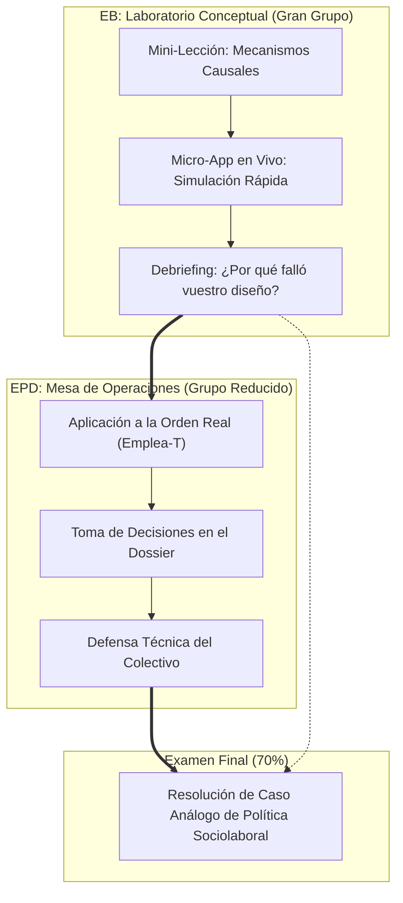

# Plan de Innovación Docente y Sincronización EB-EPD
## Asignatura: Políticas Sociolaborales y de Empleo (PSLL) — Curso 2026-27
**Profesor responsable:** Manuel A. Hidalgo Pérez  
**Facultad de Derecho — Universidad Pablo de Olavide (UPO)**  
**Marco pedagógico:** Cuaderno NotebookLM *«Estrategias y Dinámicas para un Aprendizaje Significativo y Práctico»* (ID: `b94a743f-30fe-4b04-b7b4-d4da08e06d16`)

---

## 1. Diagnóstico y Principio Rector: La Conexión Indisoluble EB ↔ EPD

### 1.1 El Punto de Partida
- **Estructura oficial del Modelo A1:** 31 horas de Enseñanzas Básicas (EB — gran grupo) y 14 horas de Enseñanzas Prácticas y de Desarrollo (EPD — grupos reducidos).
- **Sistema de evaluación oficial:** 70% prueba de evaluación final (EB) y 30% evaluación continua (EPD con asistencia obligatoria).
- **El problema tradicional:** La fractura habitual en la universidad entre teoría y práctica. Si la EB se limita a una clase magistral abstracta y la EPD se convierte en una resolución de casos desconectada, el alumno no encuentra sentido a acudir a las EB y sufre para aplicar los conceptos en las EPD.
- **El reto de la Inteligencia Artificial:** Cualquier trabajo individual o resumen para casa será resuelto por un LLM en segundos. La reflexión, el aprendizaje profundo y el desarrollo de competencias deben ocurrir **de manera sincrónica y vivencial en el aula (tanto en EB como en EPD)**.

### 1.2 El Principio Rector de la Asignatura
> **«La sesión de EB es el laboratorio conceptual y la caja de herramientas; la sesión de EPD es la mesa de operaciones real».**
>
> La EB no enseña teoría por erudición: proporciona exactamente los modelos analíticos, los mecanismos causales y la intuición empírica que el estudiante necesita **para tomar decisiones en su rol de técnico en la EPD y para responder a la pregunta de caso del examen final (el 70%)**.

---

## 2. La Arquitectura de las EPD: El Eje Conductor del Semestre

Según la propuesta de prácticas de la asignatura (`EPD/PSLL_EPD_2026-27_propuesta.docx`), las EPD se articulan en **7 sesiones de 1,5 horas** estructuradas en torno a una **simulación profesional de diseño de políticas de empleo** basada en normativas reales (como el *Programa Emplea-T* de la Junta de Andalucía):

- **Rol del estudiante:** Técnico/a de la Consejería de Empleo de la Junta de Andalucía.
- **Objetivo profesional:** Diseñar y defender incentivos públicos a la contratación, aprendiendo que *según cómo se defina el incentivo, las consecuencias sobre el mercado laboral son radicalmente distintas*.
- **Entregable transversal:** Un **Dossier de Política acumulativo** que crece práctica a práctica y constituye el núcleo de la evaluación continua (30%).

### Los Dos Casos de Estudio en EPD (3 sesiones por caso):

| Sesión EPD | Bloque | Foco de la Sesión en EPD | Conexión con los Contenidos de EB |
| :---: | :--- | :--- | :--- |
| **EPD 1** | **Introducción** | Marco institucional, rol técnico, reglas del juego y entrega del instrumental gráfico. | Conexión con Tema 1 (Marco institucional y flujos). |
| **EPD 2** | **Caso 1 · Parados Larga Duración (Fase A)** | **Diagnóstico:** Entender el colectivo y su fallo de mercado (estigma, histéresis, obsolescencia del capital humano). | **EB Temas 1 y 2:** Curva de Beveridge, emparejamiento (*matching* de Mortensen-Pissarides) y costes de búsqueda. |
| **EPD 3** | **Caso 1 · Parados Larga Duración (Fase B)** | **Diseño:** Definir cuantía, requisitos, condicionalidad y temporalidad del incentivo (tipo Orden Emplea-T). | **EB Tema 2:** Políticas Activas (PAE), tipología de incentivos a la contratación y evaluación empírica. |
| **EPD 4** | **Caso 1 · Parados Larga Duración (Fase C)** | **Consecuencias y Defensa:** Analizar efectos de peso muerto (*deadweight*), sustitución y sostenibilidad fiscal. | **EB Tema 2 y 3:** Evaluación de impacto según Card-Kluve-Weber y trade-offs distributivos. |
| **EPD 5** | **Caso 2 · Mayores de 45 años (Fase A)** | **Diagnóstico:** Obstáculos específicos a la reinserción (edadismo, costes salariales por antigüedad, horizonte de amortización). | **EB Temas 3 y 4:** Subsidio mayores de 52, trampa del desempleo, costes de despido (EPL) y dualidad laboral. |
| **EPD 6** | **Caso 2 · Mayores de 45 años (Fase B)** | **Diseño autónomo:** Definición del incentivo con menor andamiaje por parte del profesor. | **EB Temas 5 y 6:** Negociación colectiva, salarios de reserva, productividad decreciente y salario mínimo. |
| **EPD 7** | **Caso 2 · Mayores de 45 años (Fase C)** | **Consecuencias y Cierre:** Defensa del diseño, evaluación global y entrega final del Dossier de Política. | **EB Tema 7:** Reto demográfico, sostenibilidad intergeneracional y ensayo del caso del examen final. |

---

## 3. La Función de las Sesiones EB: Entrenar el Caso Práctico

Para que las EB tengan sentido y creen una necesidad imperiosa de asistencia, **cada bloque de EB se diseña como el entrenamiento previo de la siguiente sesión de EPD**:

### ¿Por qué el alumno no puede permitirse faltar a la EB?
1. **Asistir a la EB te aprueba la EPD:** En la EB se desmenuzan con la **micro-app** exactamente las mismas variables (cuantía de la subvención, meses de mantenimiento, penalizaciones) que el alumno tendrá que justificar en el Dossier de la EPD. El alumno que asiste a la EB llega a la EPD sabiendo exactamente qué hacer; quien no asiste, se bloquea ante el caso real.
2. **Asistir a la EB te aprueba el 70% del Examen Final:** El examen final no preguntará artículos de leyes de memoria, sino la resolución de un caso práctico análogo al trabajado durante el curso. La EB entrena semanalmente este razonamiento.

---

## 4. Estructura Tipo de una Sesión EB (90 a 120 minutos)

Siguiendo el modelo de la **"Clase Mejorada" (*Enhanced Lecture*)** del cuaderno NotebookLM:

| Bloque | Minutos | Actividad del Profesor | Actividad de los Alumnos |
| :--- | :---: | :--- | :--- |
| **1. El Gancho y el Enigma Previo** | 10–15 min | Lanza el misterio de la sesión conectándolo con el colectivo de la EPD (ej. *«¿Por qué subvencionar la contratación de un parado de larga duración suele traducirse en que la empresa despide a otro trabajador?»*). | Votan su intuición inicial o comentan en parejas durante 2 minutos (*Think-Pair-Share*). |
| **2. Mini-Lección 1: Mecanismo Causal** | 25 min | Explicación teórica quirúrgica del mecanismo económico (curva de Beveridge, emparejamiento, salarios de reserva). Máximo 6 diapositivas con la paleta de marca. | Toman notas focalizadas en la relación causa-efecto que necesitarán en su dossier. |
| **3. Micro-App Interactiva en Vivo** | 30 min | Proyecta el código QR de la micro-app del tema. Plantea el reto de simulación: *«Tenéis 15 minutos para calibrar el incentivo sin provocar un efecto sustitución masivo»*. | En parejas, ajustan parámetros desde el móvil o portátil y visualizan los efectos en tiempo real. |
| **4. Debriefing Socrático: El Enlace con la EPD** | 20–25 min | Muestra en pantalla gigante los resultados de la clase. Conecta los fallos cometidos en la app con los errores habituales en las convocatorias de la Junta de Andalucía. | Descubren cómo justificar técnica y económicamente su diseño para la EPD. |
| **5. Cierre: Pregunta Tipo Examen** | 10–15 min | Proyecta una pregunta real de examen sobre el caso analizado y detalla la rúbrica de corrección. | Ensayan individualmente la respuesta durante 3 minutos. |

---

## 5. El Catálogo de Micro-Apps Alineadas con las EPD

Las micro-apps interactivas en HTML/JS se redefinen para ser **simuladores preparatorios de las decisiones de las EPD**:

| Tema EB | Micro-App *ad hoc* | Conexión Directa con EPD |
| :--- | :--- | :--- |
| **Tema 1 (Mercado de trabajo)** | *Simulador de Flujos y Curva de Beveridge* | Permite diagnosticar por qué los parados de larga duración quedan desconectados de las vacantes (**Fase A del Caso 1**). |
| **Tema 2 (Políticas Activas)** | *Calibrador de Subvenciones a la Contratación* | Los alumnos ajustan cuantías y compromisos de permanencia para medir el peso muerto y el efecto sustitución (**Fases B y C del Caso 1**). |
| **Tema 3 (Políticas Pasivas)** | *Simulador de la Trampa de Inactividad* | Mide el impacto del subsidio para mayores de 52 años en el salario de reserva y la búsqueda activa (**Fase A del Caso 2**). |
| **Tema 4 (Flexibilidad y EPL)** | *Simulador de Costes de Despido y Dualidad* | Experimentar por qué las empresas prefieren no contratar a mayores de 45 ante costes de despido crecientes (**Fase B del Caso 2**). |
| **Tema 5 (Negociación Colectiva)** | *Tablero de Salarios por Antigüedad y Convenios* | Analizar el papel de las tablas salariales de convenio en las dificultades de reempleo de mayores de 45 (**Fases B y C del Caso 2**). |
| **Tema 6 y 7 (Salarios y Pensiones)** | *Simulador de Retiro, Productividad y Relevo* | Conectar el final de la vida laboral con la sostenibilidad del sistema de pensiones (**Fase C del Caso 2 y Examen Final**). |

---

## 6. Autonomía Guiada contra la IA: La Ficha de Enigma Previo

Para activar el aprendizaje autónomo sin exigir lecturas que un LLM resumiría de forma estéril:
- **Formato:** 1 página en PDF en el Aula Virtual antes de cada bloque.
- **Contenido:** Contiene **un dato real paradójico o un gráfico oficial** y **2 preguntas de juicio técnico**:
  - *«Revisa el gráfico de la página 8 de los apuntes sobre la duración del desempleo en Andalucía. ¿Por qué a partir de los 12 meses la probabilidad de salir del paro cae un 60%? Identifica los 2 mecanismos explicativos en el epígrafe 4.2 para defender tu postura en el debate del martes»*.
- **Efecto:** El alumno consulta los apuntes de forma selectiva con un propósito analítico claro, llegando a la EB con las ideas listas para la simulación.
